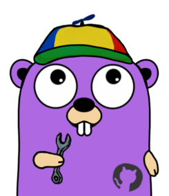
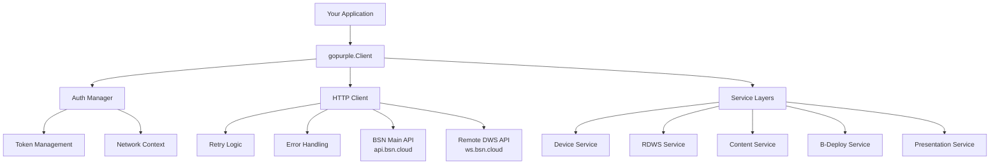
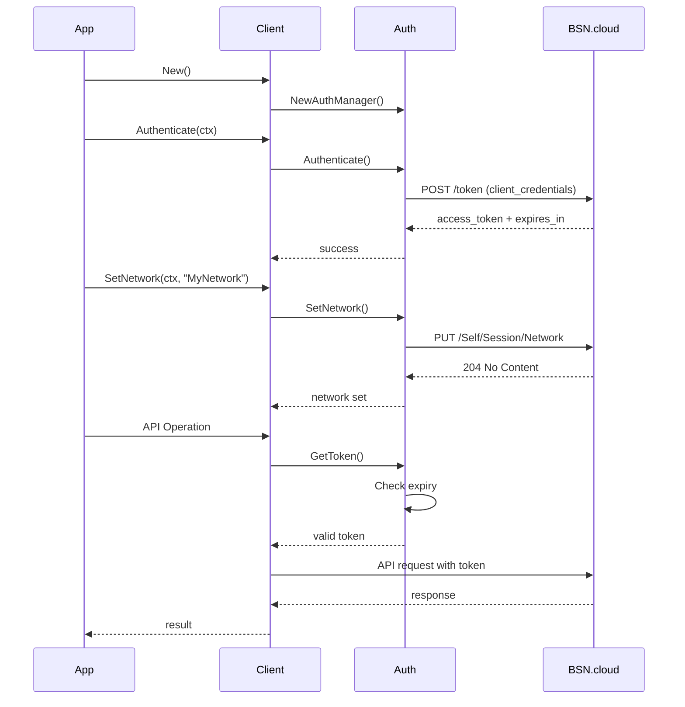

# Gopurple - BSN.cloud SDK for Go



**Status:** EXTERNAL BETA RELEASE

## Why Go Instead of Python?

Python is incredibly popular and would be an easy starting point for many developers. Its vast ecosystem, readable syntax, and extensive libraries make it a natural first choice. However, after careful consideration, we chose Go for this SDK. Here's why:

### Cross-Platform Deployment: Single Binary Simplicity

One of Python's biggest challenges is deployment complexity. Running Python reliably across Windows, macOS, Linux, and cloud environments requires managing:
- **Python interpreter installation** - Ensuring the correct Python version is available on each target system
- **Virtual environments** - Isolating dependencies per project to avoid conflicts
- **Dependency resolution** - Managing pip, requirements.txt, and potential version conflicts between packages
- **Platform-specific issues** - Some packages require different installation procedures or have OS-specific dependencies

As noted in the Python community, [dependency management can be challenging](https://nielscautaerts.xyz/python-dependency-management-is-a-dumpster-fire.html), and many teams resort to containerization just to achieve consistent deployments.

Go takes a different approach: **compile once, run anywhere**. The Go compiler produces a single, self-contained binary with no external dependencies. Deploy to Windows, Mac, Linux, or any cloud platform by simply copying one file. No runtime installation, no virtual environments, no dependency management on target systems.

### Easy to Learn

Go was designed with simplicity in mind. Its [small, consistent syntax](https://go.dev/doc/effective_go) means developers can become productive quickly. The language has:
- **25 keywords** (compared to Python's 35+)
- **One way to do things** - Go's philosophy reduces decision fatigue
- **Excellent documentation** - The standard library is well-documented with runnable examples
- **Built-in formatting** - `go fmt` eliminates style debates

### Excellent Concurrency Model

Go's concurrency primitives—goroutines and channels—provide an intuitive model for parallel operations. This is essential for an SDK that needs to:
- Handle multiple device connections simultaneously
- Process large batches of API requests efficiently
- Manage concurrent uploads and downloads

Python's Global Interpreter Lock (GIL) [limits true parallelism](https://rubyroidlabs.com/blog/2024/09/go-vs-python/), making concurrent I/O-bound operations more complex to implement correctly.

### AI and LLMs Write Excellent Go Code

Modern AI assistants and LLMs are remarkably proficient at generating Go code. This is increasingly important as developers leverage AI tools for productivity. Go's characteristics make it particularly well-suited for AI-assisted development:

- **Strong typing** catches errors at compile time, providing immediate feedback on generated code
- **Simple, consistent syntax** means AI models produce more reliable output
- **Comprehensive standard library** reduces the need for third-party dependencies
- **Clear error handling patterns** result in more predictable generated code

As the Go team notes, [Go is excellent for building LLM-powered applications](https://go.dev/blog/llmpowered), and the same qualities that make it good for *using* AI make it good for AI to *write*.

### Performance Where It Matters

Go compiles to native machine code, delivering [significantly better performance](https://uvik.net/blog/go-vs-python/) than interpreted Python for CPU-bound operations. For an SDK making hundreds of API calls, parsing large responses, and processing device data, this translates to faster execution and lower resource usage.

A comprehensive Go SDK providing type-safe access to BrightSign Network (BSN.cloud) APIs. Includes both the main REST API and Remote Diagnostic Web Server (RDWS) functionality with 73 working example programs.

## What It Does

This SDK abstracts the complexity of BSN.cloud integration:

- **OAuth2 Authentication** - Automatic token management and refresh
- **Device Management** - List, monitor, control, and provision BrightSign players
- **Remote Operations** - Screenshots, reboots, file management, diagnostics via RDWS
- **Content Management** - Upload, download, organize media files
- **B-Deploy Provisioning** - Create and manage player setup configurations
- **Presentation Management** - Create, update, schedule presentations
- **Network Management** - Handle multiple networks, groups, permissions

**Key Features:**
- Structured error types with context
- Pagination support for large datasets
- Network context management with `BS_NETWORK` environment variable support
- Concurrent-safe token handling
- 73 example CLI tools demonstrating all features
- Flexible output modes (JSON, stdout, file) for automation and scripting

## Quick Start

### Installation

```bash
go get github.com/brightdevelopers/gopurple
```

### Basic Usage

```go
package main

import (
    "context"
    "log"
    "github.com/brightdevelopers/gopurple"
)

func main() {
    // Create client (uses BS_CLIENT_ID and BS_SECRET env vars)
    client, err := gopurple.New()
    if err != nil {
        log.Fatal(err)
    }

    ctx := context.Background()

    // Authenticate and set network
    if err := client.Authenticate(ctx); err != nil {
        log.Fatal(err)
    }

    // List devices
    devices, err := client.Devices.List(ctx, nil)
    if err != nil {
        log.Fatal(err)
    }

    log.Printf("Found %d devices", len(devices.Items))
}
```

## Authentication

### Get API Credentials

1. Log into BSN.cloud
2. Navigate to **Admin** → **API Access**
3. Create new OAuth2 credentials
4. Note your Client ID and Secret

### Configure SDK

```bash
export BS_CLIENT_ID=your_client_id
export BS_SECRET=your_client_secret
export BS_NETWORK=your_network_name  # optional
```

Or configure programmatically:

```go
client, err := gopurple.New(
    gopurple.WithCredentials("client-id", "client-secret"),
    gopurple.WithNetwork("Production"),
    gopurple.WithTimeout(60*time.Second),
)
```

## Examples

The SDK includes **73 working example programs** demonstrating all functionality. Each example is a standalone CLI tool you can use immediately.

See **[examples/README.md](examples/README.md)** for complete documentation of all examples with usage instructions.

### Example Categories

| Category | Count | Examples |
|----------|-------|----------|
| **Authentication** | 2 | Token management, credential testing |
| **B-Deploy Provisioning** | 10 | Setup records, device association, configuration |
| **Device Management** | 9 | List, status, errors, operations, group management |
| **Content Management** | 4 | Upload, download, list, delete media files |
| **Presentation Management** | 8 | Create, update, list, delete presentations |
| **Group Management** | 3 | Group info, updates, deletion |
| **Subscription Management** | 3 | Device subscriptions, counts, operations |
| **Remote DWS (RDWS)** | 34 | Remote control, diagnostics, file operations, screenshots |

### Quick Example

```bash
# Build all examples
make build-examples

# List devices
./bin/main--devices-list --network Production

# Get device info via RDWS
./bin/rdws-info --serial BS123456789

# Upload content
./bin/main-content-upload --file video.mp4

# Capture screenshot
./bin/rdws-snapshot --serial BS123456789 --output screenshot.png

# Get device logs (flexible output modes)
./bin/rdws-logs-get --serial BS123456789 --logfile device.log  # to file
./bin/rdws-logs-get --serial BS123456789 --stdout | grep ERROR # to stdout
./bin/rdws-logs-get --serial BS123456789 --json                # as JSON
```

## Configuration Files

Example configuration files are provided in multiple locations:

### B-Deploy Setup Configurations (`examples/bdeploy-add-setup/`)

- **`config.json`** - Basic B-Deploy setup configuration
- **`config-comprehensive.json`** - Full setup with all debugging/logging enabled
- **`config-wifi-example.json`** - Wireless network configuration example
- **`config-annotated.json`** - Annotated configuration showing all available options

The comprehensive configuration includes:
- Local DWS enabled with password protection
- Remote DWS enabled
- All logging types enabled (playback, event, diagnostic, state, variable)
- Serial and system log debugging enabled
- Remote screenshots enabled
- Network diagnostics enabled

### Global Configuration Examples (`configs/`)

- **`bsn-control.json`** - BSN.cloud network control setup example
- **`lfn-control.json`** - Local File Network (LFN) control setup example
- **`presentation-example.json`** - Presentation structure example

### Update Configurations (`examples/bdeploy-update-setup/`)

- **`example-config.json`** - Partial setup update example
- **`example-full-update.json`** - Complete setup reconfiguration example

These show the JSON structure expected by various SDK methods and can be used as templates for your own configurations.

**Note:** SSH and Telnet must be enabled via RDWS after device provisioning.

## API Coverage

**Implementation Status:** 61 of 327 endpoints (18.7% coverage)

See **[docs/all-apis.md](docs/all-apis.md)** for a comprehensive list of all BSN.cloud API endpoints with implementation status (`[DONE]` or `[NOT-DONE]`).

### What's Implemented

✅ **Device Management** (Complete)
- List devices with pagination, filtering, sorting
- Get device details, status, errors, operations
- Update device properties, change groups
- Delete devices

✅ **Remote Diagnostic Web Server (RDWS)** (Complete)
- Device info, health, time management
- Remote reboot (normal, crash, factory reset)
- Screenshots and diagnostics
- File operations (list, upload, download, delete, rename)
- Network diagnostics (ping, traceroute, DNS lookup)
- Registry operations (read, write)
- Log and crashdump retrieval
- Firmware downloads
- SSH/Telnet management
- Local DWS control
- Storage reformatting

✅ **B-Deploy Provisioning** (Complete)
- Create, update, delete setup records
- Associate devices with setups
- List and query provisioning configurations

✅ **Content Management** (Core Features)
- Upload files with progress
- Download content files
- List with filtering and pagination
- Bulk delete operations

✅ **Presentation Management** (Core Features)
- Create, update, delete presentations
- List presentations with filtering
- Query by name or ID

✅ **Group Management** (Core Features)
- Get group information
- Update group properties
- Delete groups

✅ **Subscription Management** (Read Operations)
- List device subscriptions
- Get subscription counts
- Query permissions

### What's Not Yet Implemented

See [docs/all-apis.md](docs/all-apis.md) for the complete list of unimplemented endpoints, including:

- Autorun/Plugin management
- Dynamic playlists
- Live text feeds
- Data feeds
- Device web pages
- Live media feeds
- Scheduled downloads
- Tag management
- User management
- Web folder management
- And more...

The SDK focuses on the most commonly used operations first. Additional endpoints can be added as needed.

## Architecture



## Authentication Flow



## Usage Examples

### Device Operations

```go
// List devices with filtering
params := &gopurple.DeviceListParams{
    Filter:   "model=XD1033",
    Sort:     "lastModifiedDate desc",
    PageSize: 50,
}
devices, err := client.Devices.List(ctx, params)

// Get specific device
device, err := client.Devices.GetBySerial(ctx, "BS123456789")

// Change device group
err = client.Devices.Update(ctx, deviceID, &gopurple.DeviceUpdate{
    GroupID: newGroupID,
})

// Delete device
err = client.Devices.Delete(ctx, deviceID)
```

### Remote Operations (RDWS)

```go
// Get device info
info, err := client.RDWS.GetInfo(ctx, serial)

// Capture screenshot
screenshot, err := client.RDWS.Snapshot(ctx, serial)
os.WriteFile("screenshot.png", screenshot, 0644)

// Reboot device
success, err := client.RDWS.Reboot(ctx, serial, "normal")

// List files on device
files, err := client.RDWS.ListFiles(ctx, serial, "/storage/sd/")

// Upload file to device
err = client.RDWS.UploadFile(ctx, serial, localPath, remotePath)
```

### Content Management

```go
// Upload content
upload, err := client.Content.Upload(ctx, "video.mp4", "/videos/")

// List content with filtering
content, err := client.Content.List(ctx, &gopurple.ContentListParams{
    Filter:   "mediaType eq 'Video'",
    PageSize: 100,
})

// Download content
data, err := client.Content.Download(ctx, contentID)

// Delete content by filter
err = client.Content.DeleteByFilter(ctx, "name contains 'old'")
```

### B-Deploy Provisioning

```go
// Create setup record from config
config := &types.BDeploySetupConfig{
    NetworkName: "Production",
    Username:    "admin@example.com",
    PackageName: "retail-display",
    SetupType:   "bsn",
    Network: types.NetworkConfig{
        TimeServers: []string{"time.bsn.cloud"},
        Interfaces: []types.NetworkInterface{
            {
                ID:                      "eth0",
                Type:                    "Ethernet",
                Proto:                   "DHCPv4",
                ContentDownloadEnabled:  true,
                HealthReportingEnabled:  true,
            },
        },
    },
}

setupID, err := client.BDeploy.CreateSetup(ctx, config)

// Associate device with setup
err = client.BDeploy.AssociateDevice(ctx, serial, setupID)
```

### Error Handling

```go
devices, err := client.Devices.List(ctx, nil)
if err != nil {
    if gopurple.IsAuthenticationError(err) {
        log.Println("Auth failed - check credentials")
    } else if gopurple.IsNetworkError(err) {
        log.Println("Network issue - check connectivity")
    } else if gopurple.IsRateLimitError(err) {
        log.Println("Rate limited - retry later")
    } else if gopurple.IsRetryableError(err) {
        log.Println("Temporary error - will retry")
    } else {
        log.Printf("API error: %v", err)
    }
    return
}
```

## Development

### Build and Test

```bash
# Run all tests
make test

# Build all example programs
make build-examples

# Build specific example
make build-main--devices-list

# Clean build artifacts
make clean

# Run all (test + build)
make all
```

### Project Structure

```
gopurple/
├── gopurple.go                      # Main SDK client interface
├── internal/
│   ├── auth/                       # OAuth2 authentication
│   ├── config/                     # Configuration management
│   ├── errors/                     # Error types
│   ├── http/                       # HTTP client wrapper
│   ├── services/                   # API service implementations
│   └── types/                      # Data structures
├── examples/                        # 73 example CLI programs
│   ├── main--devices-list/
│   ├── rdws-info/
│   ├── rdws-logs-get/
│   ├── bdeploy-add-setup/
│   │   ├── config.json             # Basic setup example
│   │   ├── config-comprehensive.json
│   │   └── config-wifi-example.json
│   ├── bdeploy-update-setup/
│   │   ├── example-config.json
│   │   └── example-full-update.json
│   ├── README.md                   # Complete examples documentation
│   └── ... (70 more examples)
├── configs/                         # Global configuration examples
│   ├── bsn-control.json
│   ├── lfn-control.json
│   └── presentation-example.json
├── docs/
│   ├── all-apis.md                 # Complete API endpoint reference
│   ├── bdeploy-config-reference.md # B-Deploy configuration guide
│   ├── bdeploy-association.md      # Device association documentation
│   ├── download-presentation.md    # Presentation download guide
│   └── need-json-out.md            # Programs needing JSON output
├── images/
│   └── logo.png                    # Project logo
└── Makefile                         # Build targets
```

## Requirements

- **Go 1.21+**
- **BSN.cloud API credentials** (OAuth2 Client ID and Secret)
- **Network access** to:
  - `auth.bsn.cloud` (authentication)
  - `api.bsn.cloud` (main API)
  - `ws.bsn.cloud` (RDWS API)

## Contributing

This SDK prioritizes the most commonly used BSN.cloud operations. If you need additional endpoints:

1. Check [docs/all-apis.md](docs/all-apis.md) to see if it's documented
2. Look at existing service implementations in `internal/services/`
3. Follow the established patterns for consistency
4. Add tests and example programs
5. Update documentation

## License

This is an unofficial SDK for BSN.cloud integration.

## Resources

### Documentation

- **BSN.cloud Documentation**: https://docs.brightsign.biz/
- **Complete API Endpoint Reference**: [docs/all-apis.md](docs/all-apis.md)
- **Example Programs Guide**: [examples/README.md](examples/README.md)
- **B-Deploy Configuration Reference**: [docs/bdeploy-config-reference.md](docs/bdeploy-config-reference.md)
- **B-Deploy Device Association**: [docs/bdeploy-association.md](docs/bdeploy-association.md)
- **Presentation Download Guide**: [docs/download-presentation.md](docs/download-presentation.md)
- **Programs Needing JSON Output**: [docs/need-json-out.md](docs/need-json-out.md)

### Links

- **BSN.cloud Admin Panel**: https://bsn.cloud/
- **GitHub Repository**: https://github.com/brightdevelopers/gopurple

## Disclaimer

**EXPERIMENTAL ONLY** - This SDK is provided as-is for integration with BrightSign Network. While actively used in production, it is not officially supported by BrightSign LLC. Use at your own discretion.
