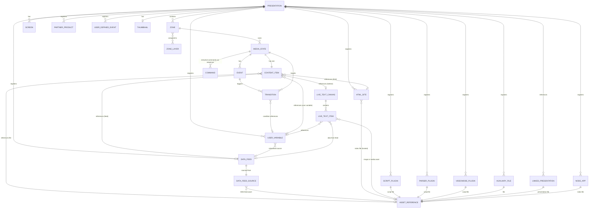

# BrightSign Presentation Data Model — Definition

---

## 1. Introduction

A BrightSign **presentation** is the complete, self-contained description of what a BrightSign media player will display and how it will behave during playback. It encodes everything the player needs: which content to show, in which screen regions, for how long, in what order, and how external signals (button presses, serial data, timers, network messages, GPS events, etc.) trigger transitions between content states.

The presentation is structured around a **state-machine model**. Each screen region (a **Zone**) runs an independent state machine whose nodes are **MediaStates** (what to display right now) and whose directed edges are **Events** paired with **Transitions** (what fires and where to go). This data model governs every entity in that structure, from the top-level presentation properties down to individual commands executed when entering or leaving a state.

This document defines the logical data model only. It is independent of any programming language, serialization format, or storage mechanism.

---

## 2. Entity Overview

| Entity | Description |
|---|---|
| Presentation | Root entity. Holds all presentation-wide configuration and owns all other entities. |
| Zone | A rectangular screen region that independently plays content via a state machine. |
| ZoneLayer | A rendering stack slot that groups zones by hardware decoder assignment. |
| MediaState | A node in a zone's state machine. Holds exactly one content item. |
| ContentItem | What a media state displays. Discriminated by content type. |
| Event | A trigger condition attached to a media state. When fired, activates transitions. |
| Transition | A directed edge from an event to a target media state, optionally guarded by a condition. |
| Command | A side-effect instruction executed on state entry, state exit, or event. |
| UserVariable | A named, persistent value readable and writable during playback. |
| DataFeed | An external content source (RSS, MRSS, BSN feed) used by content items. |
| DataFeedSource | The fetch specification for a data feed (URL or BSN asset reference). |
| HtmlSite | A web application loaded into a zone (hosted locally or remote URL). |
| NodeApp | A server-side application running on the player to extend functionality. |
| LiveTextCanvas | A compositing surface for dynamic text and image overlay. |
| LiveTextItem | A single renderable element placed on a LiveTextCanvas. |
| ScriptPlugin | A BrightScript script file providing general-purpose scripting. |
| ParserPlugin | A BrightScript script file providing custom data feed parsing. |
| VideoModePlugin | A BrightScript script file providing custom video mode initialization. |
| AuxiliaryFile | An additional asset bundled with the presentation but not directly referenced by content. |
| LinkedPresentation | Another presentation that this presentation can switch to. |
| UserDefinedEvent | A named group of event specifications treated as a single logical event. |
| Screen | A physical display output for multi-monitor configurations. |
| PartnerProduct | A third-party hardware device (touch controller, serial device) configured for use. |
| Thumbnail | A preview image for the presentation. |
| AssetReference | An entry in the presentation's asset registry mapping an identifier to a file. |

---

## 3. Entity-Relationship Diagram

---

## 4. Entities

### 4.1 Presentation

**Description:** The root entity of the data model. A presentation describes everything a BrightSign player will do: which display configuration it targets, how content is arranged across zones, and all supporting resources. Every other entity in the model belongs to exactly one presentation.

**Attributes:**

| Attribute | Type | Required | Description |
|---|---|---|---|
| id | Identifier | Yes | Globally unique identifier for this presentation. |
| name | String | Yes | Human-readable name. |
| version | String | Yes | Data model schema version this presentation was authored with. |
| videoMode | Enum (VideoMode) | Yes | Video resolution and frame rate for the primary output. |
| size | Size (width, height in pixels) | Yes | Canvas dimensions derived from the video mode. |
| model | Enum (PlayerModel) | Yes | Target BrightSign player hardware model. |
| monitorOrientation | Enum (MonitorOrientationType) | Yes | Physical monitor orientation (Landscape, Portrait, etc.). |
| monitorOverscan | Enum (MonitorOverscanType) | Yes | Overscan compensation mode. |
| videoConnector | Enum (VideoConnectorType) | Yes | Primary video output connector type. |
| deviceWebPageDisplay | Enum (DeviceWebPageDisplay) | Yes | Whether and how the on-device web page is displayed. |
| backgroundScreenColor | Color (RGBA) | Yes | Background color shown behind all zones. |
| forceResolution | Boolean | Yes | Force the declared resolution even if the monitor reports differently. |
| tenBitColorEnabled | Boolean | Yes | Enable 10-bit color depth output. |
| dolbyVisionEnabled | Boolean | Yes | Enable Dolby Vision HDR output. |
| fullResGraphicsEnabled | Boolean | Yes | Enable full-resolution graphics plane. |
| audioConfiguration | Enum (AudioConfiguration) | Yes | Audio output configuration. |
| audioAutoLevel | Boolean | Yes | Enable automatic audio level adjustment. |
| htmlEnableJavascriptConsole | Boolean | Yes | Enable JavaScript console for HTML content. |
| alphabetizeVariableNames | Boolean | Yes | Display user variables in alphabetical order. |
| autoCreateMediaCounterVariables | Boolean | Yes | Automatically create counter variables for media files. |
| resetVariablesOnPresentationStart | Boolean | Yes | Reset all user variables when playback starts. |
| networkedVariablesUpdateInterval | Integer (seconds) | Yes | How often networked user variables are synchronized. |
| delayScheduleChangeUntilMediaEndEvent | Boolean | Yes | Wait for media end before applying a scheduled presentation change. |
| language | Enum (LanguageType) | Yes | Display language for the presentation. |
| languageKey | Enum (LanguageKeyType) | Yes | Keyboard language layout. |
| flipCoordinates | Boolean | Yes | Mirror zone coordinate system (for rear-projection). |
| inactivityTimeout | Boolean | Yes | Whether an inactivity timeout is active. |
| inactivityTime | Integer (seconds) | Yes | Seconds of inactivity before the timeout event fires. |
| touchCursorDisplayMode | Enum (TouchCursorDisplayModeType) | Yes | Whether and how to show a cursor on touch displays. |
| udpDestinationAddressType | Enum (UdpAddressType) | Yes | UDP broadcast destination type. |
| udpDestinationAddress | String | Yes | UDP destination IP address. |
| udpDestinationPort | Integer | Yes | UDP destination port number. |
| udpReceiverPort | Integer | Yes | UDP listening port number. |
| enableEnhancedSynchronization | Reference (EnhancedSynchronization) or null | No | Multi-player synchronization configuration; null if disabled. |
| disableSettingsHandler | Boolean | Yes | Disable the player's built-in settings handler. |
| htmlEnableChromiumVideoPlayback | Boolean | No | Enable Chromium-based video playback in HTML zones. |
| gpsConfiguration | Reference (GpsConfiguration) | Yes | GPS hardware and region configuration. |
| serialPortConfigurations | List of SerialPortConfiguration | Yes | Serial port configuration for each physical port. |
| gpio | List of Enum (GpioType) | Yes | GPIO pin direction assignments. |
| buttonPanels | Map (panel name → ButtonPanelConfiguration) | Yes | Button panel hardware configuration. |
| irRemote | Reference (IrRemote) | Yes | Infrared receiver and transmitter configuration. |
| audioSignPropertyMap | Map (audio output name → AudioSignProperties) | Yes | Per-output volume range constraints. |
| wssDeviceSpec | Reference (WssDeviceSpec) or empty | Yes | WebSocket Server device specification. |
| lastModifiedTime | DateTime string | Yes | Timestamp of the most recent edit. |

**Sub-structure — EnhancedSynchronization:**

| Attribute | Type | Required | Description |
|---|---|---|---|
| deviceIsSyncMaster | Boolean | Yes | Whether this player is the synchronization master. |
| ptpDomain | Integer | Yes | PTP domain number for synchronization. |

**Sub-structure — SerialPortConfiguration:**

| Attribute | Type | Required | Description |
|---|---|---|---|
| port | String | Yes | Port identifier (e.g., "COM1"). |
| baudRate | Integer | Yes | Serial baud rate. |
| dataBits | Integer | Yes | Number of data bits. |
| stopBits | Integer | Yes | Number of stop bits. |
| parity | Enum (SerialParity) | Yes | Parity mode: None, Even, Odd. |
| protocol | Enum (SerialProtocol) | Yes | Protocol: ASCII or Binary. |
| sendEol | Enum (SerialEol) | Yes | End-of-line character for sending: CR, LF, CRLF. |
| receiveEol | Enum (SerialEol) | Yes | End-of-line character for receiving: CR, LF, CRLF. |
| invertSignals | Boolean | Yes | Invert serial signal polarity. |
| connectedDevice | Enum (SerialConnectedDeviceType) | Yes | Type of device connected: None or GPS. |
| gps | Boolean | Yes | Whether this port is used for GPS input. |

**Relationships:**
- A presentation owns zero or more Zones, Screens, HtmlSites, NodeApps, DataFeeds, UserVariables, ScriptPlugins, ParserPlugins, VideoModePlugins, AuxiliaryFiles, LinkedPresentations, PartnerProducts, UserDefinedEvents, and DeviceWebPages.
- A presentation has zero or one Thumbnail.
- A presentation owns an asset registry (set of AssetReferences) covering every file referenced anywhere within it.
- A presentation may have one custom autorun file (AssetReference).
- A presentation may have one BMAP specification file (AssetReference).

**Constraints:**
- When a presentation is created, it receives one default Zone of a type appropriate to the target player model.
- The `size` attribute is derived from `videoMode` and may not be set independently except when changing the video mode.
- Changing the `videoMode` proportionally rescales all zone positions.
- Changing the `model` may invalidate events and commands that require hardware not present on the new model.
- `inactivityTime` is only meaningful when `inactivityTimeout` is true.
- `networkedVariablesUpdateInterval` is only meaningful when at least one UserVariable has `isNetworked` set to true.

---

### 4.2 Zone

**Description:** A rectangular region of the screen that independently displays content. Each zone has a type that constrains what content it can hold and how it is rendered. Zones run independent state machines concurrently during playback.

**Attributes:**

| Attribute | Type | Required | Description |
|---|---|---|---|
| id | Identifier | Yes | Unique identifier. |
| name | String | Yes | Human-readable zone name. |
| type | Enum (ZoneType) | Yes | Zone type: Video, Image, Audio, Ticker, Clock, BackgroundImage, VideoOrImages, EnhancedAudio, etc. |
| tag | String | Yes | Short label used to identify the zone in commands and messages. |
| nonInteractive | Boolean | Yes | True = playlist (non-interactive) mode; false = interactive mode. |
| initialMediaStateId | Identifier | Yes | The first MediaState to play when the zone starts. Set to the null ID if the zone is empty. |
| position | Rectangle (x, y, width, height in pixels) | Yes | Position and size of the zone on the presentation canvas. |
| properties | ZoneSpecificProperties (variant by type) | Yes | Type-specific rendering and audio properties. |

**Zone-Specific Properties by Type:**

*Audio zone properties (applies to Audio, EnhancedAudio, Video, VideoOrImages zone types):*

| Attribute | Type | Description |
|---|---|---|
| audioOutput | Enum (AudioOutputSelectionType) | Which audio output to use. |
| audioMode | Enum (AudioModeType) | Mono, stereo, or surround mode. |
| audioMapping | Enum (AudioMappingType) | Channel mapping. |
| audioOutputAssignments | Map (output name → AudioOutputType) | Per-output routing. |
| audioMixMode | Enum (AudioMixModeType) | Audio mixing mode. |
| audioVolume | Integer | Zone audio volume level. |
| minimumVolume | Integer | Minimum allowable volume for this zone. |
| maximumVolume | Integer | Maximum allowable volume for this zone. |

*EnhancedAudio additional property:*

| Attribute | Type | Description |
|---|---|---|
| fadeLength | Integer (milliseconds) | Audio fade duration on state transitions. |

*Video zone additional properties:*

| Attribute | Type | Description |
|---|---|---|
| viewMode | Enum (ViewModeType) | How video is scaled/cropped within the zone. |
| videoVolume | Integer | Video audio track volume. |
| maxContentResolution | Enum (MosaicMaxContentResolutionType) | Maximum content resolution for mosaic mode. |
| mosaicDecoderName | String | Optional decoder name for mosaic mode. |

*Image zone properties:*

| Attribute | Type | Description |
|---|---|---|
| imageMode | Enum (ImageModeType) | How images are scaled/cropped: ScaleToFit, Letterboxed, CenterImage, etc. |

*Ticker zone properties:*

| Attribute | Type | Description |
|---|---|---|
| textWidget | TextWidget | Text rendering properties (lines, rotation, alignment, scrolling method). |
| widget | Widget | Visual style properties (colors, font, background bitmap). |
| scrollSpeed | Integer | Text scrolling speed. |

*Clock zone properties:*

| Attribute | Type | Description |
|---|---|---|
| rotation | Enum (RotationType) | Clock display rotation. |
| widget | Widget | Visual style properties. |

**Widget sub-structure:**

| Attribute | Type | Description |
|---|---|---|
| foregroundTextColor | Color (RGBA) | Text foreground color. |
| backgroundTextColor | Color (RGBA) | Text background color. |
| font | Identifier or "System" | Asset identifier of a font file, or "System" for the default font. |
| fontSize | Integer | Font size in points. |
| backgroundBitmapAssetId | Identifier | Asset identifier for a background bitmap image. |
| stretchBitmapFile | Boolean | Whether to stretch the background bitmap to fill the widget. |
| safeTextRegion | Rectangle or null | Optional region within the widget where text is safe to render. |

**TextWidget sub-structure:**

| Attribute | Type | Description |
|---|---|---|
| numberOfLines | Integer | Number of visible text lines. |
| delay | Integer (milliseconds) | Delay before scrolling starts. |
| rotation | Enum (RotationType) | Text rotation. |
| alignment | Enum (TextHAlignmentType) | Horizontal text alignment. |
| scrollingMethod | Enum (TextScrollingMethodType) | How text scrolls: None, Animated, etc. |

**Relationships:**
- A zone belongs to exactly one Presentation.
- A zone owns zero or more MediaStates; the ordered sequence of media states within the zone is maintained.
- A zone is assigned to one or more ZoneLayers for rendering-stack ordering.
- A zone has exactly one initial MediaState (or is empty).
- In playlist (non-interactive) mode, media states form a chain connected by timer events.

**Constraints:**
- A zone must have a type compatible with the content items it contains (e.g., an Audio zone cannot hold a Video content item).
- A zone's position rectangle must fit within the presentation canvas.
- In a non-interactive zone, the ordering of media states determines playback sequence.
- A zone in interactive mode may have media states connected by arbitrary event-transition graphs.
- Zone tags must be unique within a presentation.

---

### 4.3 ZoneLayer

**Description:** A ZoneLayer represents a hardware rendering plane (video decoder assignment, graphics plane, audio plane, or invisible plane). Zones are assigned to layers to control rendering order and hardware resource allocation.

**Attributes:**

| Attribute | Type | Required | Description |
|---|---|---|---|
| id | Identifier | Yes | Unique identifier (well-known values: videoLayer1–4, graphicsLayer, audioLayer, invisibleLayer). |
| type | Enum (ZoneLayerType) | Yes | Layer type: Video, Graphics, Audio, Invisible. |
| zoneSequence | List of Identifier | Yes | Ordered list of zone IDs assigned to this layer (bottom-to-top rendering order). |

**Video ZoneLayer additional attributes:**

| Attribute | Type | Required | Description |
|---|---|---|---|
| layerType | Enum (VideoZoneLayerType) | Yes | Specific video decoder type. |
| index | Integer | Yes | Hardware decoder index. |
| sharedDecoder | Boolean | Yes | Whether this decoder is shared among multiple zones (mosaic mode). |
| enableMosaicDeinterlacer | Boolean | Yes | Enable deinterlacing in mosaic mode. |

**Relationships:**
- A ZoneLayer belongs to exactly one Presentation.
- A ZoneLayer contains an ordered list of zero or more Zones.
- Zone layers are ordered from bottom (rendered first) to top (rendered last).

**Constraints:**
- A zone can be assigned to at most one video layer, at most one graphics layer, at most one audio layer, and at most one invisible layer.
- The number of available video layers is determined by the target player model.
- A shared-decoder video layer can contain multiple zones arranged as a mosaic.

---

### 4.4 MediaState

**Description:** A node in a zone's content state machine. When a zone is in a given media state, it displays the content item associated with that state. The zone transitions to a different media state when one of the state's events fires.

**Attributes:**

| Attribute | Type | Required | Description |
|---|---|---|---|
| id | Identifier | Yes | Unique identifier. |
| name | String | Yes | Human-readable label (shown in the authoring UI). |
| tag | String | Yes | Short label used in messages and log output. |
| container | MediaStateContainer | Yes | The entity that owns this media state (a Zone, MediaList, PlayFile, SuperState, or LocalPlaylist). |
| contentItem | ContentItem | Yes | The content this state displays when active. |

**MediaStateContainer sub-structure:**

| Attribute | Type | Description |
|---|---|---|
| id | Identifier | Identifier of the owning container. |
| type | Enum (MediaStateContainerType) | Container type: Zone, MediaList, PlayFile, SuperState, LocalPlaylist. |

**Relationships:**
- A media state belongs to exactly one container.
- A media state holds exactly one ContentItem.
- A media state has zero or more Events (triggers).
- A media state has zero or more CommandSequences (state entry and state exit commands).
- In an interactive zone, a media state may be the target of Transitions from any other state's events.

**Constraints:**
- A media state's content item type must be compatible with its container zone type.
- Every zone must have at most one initial media state; the initial media state is the first one played.
- A playlist zone's media states are implicitly ordered; their events and transitions are auto-generated timer events.
- Deleting a media state also removes all its events, transitions, and commands.

---

### 4.5 ContentItem

**Description:** A ContentItem describes what a MediaState displays. Content items are discriminated by type; each type carries the parameters specific to that kind of content.

**Common attributes (all ContentItem types):**

| Attribute | Type | Required | Description |
|---|---|---|---|
| name | String | Yes | Display name of this content item. |
| type | Enum (ContentItemType) | Yes | Discriminator identifying the content item subtype. |
| notes | String | No | Optional author notes about this content item. |

**ContentItem subtypes and their additional attributes:**

**Video ContentItem** (type = Video):

| Attribute | Type | Description |
|---|---|---|
| assetId | Identifier | Reference to an AssetReference for the video file. |
| volume | Integer | Playback volume. |
| videoDisplayMode | Enum (VideoDisplayModeType) | Display scaling mode. |
| automaticallyLoop | Boolean | Loop the video when it ends. |

**Audio ContentItem** (type = Audio):

| Attribute | Type | Description |
|---|---|---|
| assetId | Identifier | Reference to an AssetReference for the audio file. |
| volume | Integer | Playback volume. |

**Image ContentItem** (type = Image):

| Attribute | Type | Description |
|---|---|---|
| assetId | Identifier | Reference to an AssetReference for the image file. |
| useImageBuffer | Boolean | Use the image buffer for smooth display. |
| videoPlayerRequired | Boolean | Requires the video decoder for display. |
| defaultTransition | Enum (TransitionType) | Default transition effect when this image appears. |
| transitionDuration | Integer (milliseconds) | Duration of the default transition. |

**HTML ContentItem** (type = Html):

| Attribute | Type | Description |
|---|---|---|
| siteId | Identifier | Reference to an HtmlSite. |
| enableBrightSignJavascriptObjects | Boolean | Expose BrightSign JS APIs to the HTML page. |
| enableCrossDomainPolicyChecks | Boolean | Enforce cross-domain security policy. |
| ignoreHttpsCertificateErrors | Boolean | Ignore TLS certificate errors. |
| enableCamera | Boolean | Enable camera access from HTML. |
| enableMouseEvents | Boolean | Enable mouse event delivery. |
| displayCursor | Boolean | Show cursor in the zone. |
| hwzOn | Boolean | Enable hardware z-ordering for the HTML layer. |
| useUserStylesheet | Boolean | Apply a custom CSS stylesheet. |
| userStylesheetAssetId | Identifier | Optional AssetReference for a CSS file. |
| customFonts | List of Font | Optional list of custom fonts for the site. |
| enableFileURLSharedStorage | Boolean | Allow file:// URL shared storage access. |
| enableHtmlURLSharedStorage | Boolean | Allow HTML URL shared storage access. |

**Data Feed ContentItem** (type = DataFeed — generic ticker feed):

| Attribute | Type | Description |
|---|---|---|
| dataFeedId | Identifier | Reference to a DataFeed. |

**MRSS Data Feed ContentItem** (type = MrssDataFeed — Media RSS feed):

| Attribute | Type | Description |
|---|---|---|
| dataFeedId | Identifier | Reference to a DataFeed. |
| videoPlayerRequired | Boolean | Whether this feed's media items require the video decoder. |

**Twitter Feed ContentItem** (type = TwitterFeed — deprecated):

| Attribute | Type | Description |
|---|---|---|
| userName | String | Twitter username. |
| authToken | String | OAuth token. |
| encryptedTwitterSecrets | String | Encrypted OAuth secrets. |
| updateInterval | Integer (seconds) | How often to fetch new tweets. |
| restrictNumberOfTweets | Enum (TwitterFeedRestrictionType) | Restriction mode. |
| numberOfTweetsToShow | Integer | Maximum tweets to display. |
| numberOfRecentDaysForTweets | Integer | Only show tweets from within this many recent days. |

**User Variable ContentItem** (type = UserVariable):

| Attribute | Type | Description |
|---|---|---|
| userVariableId | Identifier | Reference to a UserVariable whose value is displayed. |

**Live Video ContentItem** (type = LiveVideo):

| Attribute | Type | Description |
|---|---|---|
| volume | Integer | Audio volume for the live video input. |
| overscan | Boolean | Apply overscan compensation. |

**Video Stream ContentItem** (type = VideoStream):

| Attribute | Type | Description |
|---|---|---|
| url | ParameterizedString | URL of the video stream (may include UserVariable references). |
| volume | Integer | Playback volume. |

**Audio Stream ContentItem** (type = AudioStream):

| Attribute | Type | Description |
|---|---|---|
| url | ParameterizedString | URL of the audio stream. |
| volume | Integer | Playback volume. |

**MJPEG Stream ContentItem** (type = MjpegStream):

| Attribute | Type | Description |
|---|---|---|
| url | ParameterizedString | URL of the MJPEG stream. |
| rotation | Enum (RotationType) | Display rotation for the stream. |

**Media List ContentItem** (type = MediaList — nested sub-state-machine with ordered items):

| Attribute | Type | Description |
|---|---|---|
| playbackType | Enum (MediaListPlaybackType) | Sequential, shuffle, etc. |
| shuffle | Boolean | Randomize item order. |
| support4KImage | Boolean | Enable 4K image support. |
| sendMediaZoneMessage | Boolean | Emit a zone message when each item plays. |
| transition | Enum (TransitionType) | Transition effect between items. |
| transitionDuration | Integer (milliseconds) | Transition duration. |
| autoTransitions | Boolean | Automatically advance through items. |
| inactivityTimeout | Boolean | Enable inactivity timeout for the list. |
| inactivityTime | Integer (seconds) | Inactivity timeout duration. |
| startIndex | Integer | Index of the first item to play. |
| useDataFeed | Boolean | Use a data feed as the source of items. |
| dataFeedId | Identifier | Reference to a DataFeed (when useDataFeed is true). |

**Local Playlist ContentItem** (type = LocalPlaylist):

| Attribute | Type | Description |
|---|---|---|
| defaultDataFeedId | Identifier | Reference to a DataFeed used as the default playlist source. |

**Play File ContentItem** (type = PlayFile — plays a file named by a user variable):

| Attribute | Type | Description |
|---|---|---|
| triggerType | Enum (PlayFileTriggerType) | When to trigger playback. |
| useDefaultMedia | Boolean | Fall back to default media if the variable names an invalid file. |
| userVariableIdOrName | String | Identifier or name of the UserVariable that provides the filename. |
| defaultMediaId | Identifier | AssetReference for the fallback media file. |
| useDataFeed | Boolean | Use a data feed as the source. |
| dataFeedId | Identifier | Reference to a DataFeed. |

**Event Handler ContentItem** (type = EventHandler — no display, only handles events):

| Attribute | Type | Description |
|---|---|---|
| stopPlayback | Boolean | Stop playback when active. |

**Time ContentItem** (type = Time — displays the current time):
No additional attributes beyond the common fields.

**Date ContentItem** (type = Date — displays the current date):
No additional attributes beyond the common fields.

**Live Text ContentItem** (type = LiveText):

| Attribute | Type | Description |
|---|---|---|
| canvasId | Identifier | Reference to a LiveTextCanvas. |

**Super State ContentItem** (type = SuperState — hierarchical nested state machine):

| Attribute | Type | Description |
|---|---|---|
| initialMediaStateId | Identifier | The initial MediaState of the nested state machine. |

**ParameterizedString sub-structure:**

A ParameterizedString is a sequence of components, where each component is either a literal text segment or a reference to a UserVariable whose current value is substituted at playback time.

| Attribute | Type | Description |
|---|---|---|
| type | Enum (StringParameterType) | Text (literal) or UserVariable (reference). |
| value | String | The literal text or the identifier of the UserVariable. |

**ParameterizedNumber sub-structure:**

A ParameterizedNumber is either a literal numeric value or a reference to a UserVariable.

| Attribute | Type | Description |
|---|---|---|
| type | Enum (NumberParameterType) | Number (literal), UserVariable (ID reference), or UserVariableName (name reference). |
| value | Number or String | The literal number, or the identifier/name of the UserVariable. |

**Constraints:**
- A ContentItem of type Video, Audio, Image, or Text must reference a valid AssetReference.
- A ContentItem of type Html must reference a valid HtmlSite.
- A ContentItem of type MrssDataFeed or DataFeed must reference a valid DataFeed.
- A ContentItem of type UserVariable must reference a valid UserVariable.
- A ContentItem of type LiveText must reference a valid LiveTextCanvas.
- Content item types are constrained by the zone type: for example, an Audio zone cannot contain a Video content item.

---

### 4.6 Event

**Description:** A trigger condition attached to a MediaState. When the event fires during playback, it activates the Transitions attached to it, causing the zone to move to a new state.

**Attributes:**

| Attribute | Type | Required | Description |
|---|---|---|---|
| id | Identifier | Yes | Unique identifier. |
| name | String | Yes | Human-readable label. |
| mediaStateId | Identifier | Yes | The MediaState this event is attached to. |
| type | Enum (EventType) | Yes | The category of trigger (Timer, MediaEnd, Keyboard, Serial, GPIO, etc.). |
| data | EventData (variant by type) | No | Type-specific parameters. Null for events that carry no parameters (e.g., MediaEnd). |
| action | Enum (EventIntrinsicAction) | No | Optional built-in action that fires alongside transitions (e.g., SequenceForward). |
| disabled | Boolean | Yes | When true, the event exists in the model but will not fire during playback. |

**Event data variants by EventType:**

| EventType | Data Fields |
|---|---|
| Timer, MediaEndOrTimer | interval (Integer, milliseconds) |
| MediaEnd | (none) |
| Keyboard | data (String, key code) |
| Serial | port (String), data (String), assignInputToUserVariable (Boolean), assignWildcardToUserVariable (Boolean), userVariableToAssignInput (Identifier, optional), userVariableToAssignWildcard (Identifier) |
| Gpio | buttonNumber (Integer), buttonDirection (Enum ButtonDirection), pressContinuous (InputControlConfiguration or null) |
| Button | buttonNumber (Integer), buttonDirection (Enum ButtonDirection), pressContinuous (InputControlConfiguration or null) |
| Bp (BrightPanel) | bpType (Enum BpType), bpIndex (Enum BpIndex), buttonNumber (Integer), pressContinuous (InputControlConfiguration or null) |
| Remote (IR) | data (String), buttonDirection (Enum ButtonDirection) |
| Udp | data (String), label (String), export (Boolean), user variable assignment fields |
| Synchronize | data (String, sync key) |
| InternalSynchronize | data (String) |
| TimeClock | type (Enum DmTimeClockEventType), data (one of: DateTime, ByUserVariable, DailyOnce, DailyPeriodic) |
| Gps | distanceUnits (Enum DistanceUnits), regionEventData (direction, radius, latitude, longitude) |
| RectangularTouch | region (Rectangle or null) |
| ZoneMessage | data (String), user variable assignment fields |
| PluginMessage | pluginId (Identifier), message (String), user variable assignment fields |
| Usb | data (String), user variable assignment fields |
| WssEvent | port (String), wssEventId (String), wssEventName (String), optional wssEventParameter |
| Bmap | port (String), functionBlock (String), function (String), operator (String), field (String), bitfield (String), data (String or null), user variable assignment fields |
| UserDefinedEvent | data (String) |

**InputControlConfiguration sub-structure** (used for continuous button press events):

| Attribute | Type | Description |
|---|---|---|
| repeatInterval | Integer (seconds) | How often to repeat the event while the button is held. |
| initialHoldoff | Integer (seconds) | Delay before the first repeat fires. |

**TimeClock data variants:**

- DateTime: dateTime (DateTime value)
- ByUserVariable: userVariableId (Identifier of a UserVariable containing the date/time)
- DailyOnce: daysOfWeek (Bitmask of days), time (Time value)
- DailyPeriodic: daysOfWeek (Bitmask of days), startTime (Time), endTime (Time), interval (Integer, minutes)

**Relationships:**
- An event belongs to exactly one MediaState.
- An event has zero or more Transitions.
- An event may have zero or more Commands in an associated command sequence.

**Constraints:**
- An event type must be compatible with the hardware configured in the presentation (e.g., a GPIO event requires GPIO inputs to be configured).
- An event type must be compatible with the content item type of the owning MediaState.
- An event type must be compatible with the target player model.
- Duplicate events of the same type and data on the same media state are not permitted.

---

### 4.7 Transition

**Description:** A directed edge from an Event to a target MediaState. When the event fires and the transition's condition is satisfied (or when no condition is present), the zone moves to the target state and applies the visual transition effect.

**Attributes:**

| Attribute | Type | Required | Description |
|---|---|---|---|
| id | Identifier | Yes | Unique identifier. |
| name | String | Yes | Human-readable label. |
| eventId | Identifier | Yes | The Event that triggers this transition. |
| targetMediaStateId | Identifier | Yes | The MediaState to transition to. |
| type | Enum (TransitionType) | Yes | Visual transition effect: Cut, Fade, WipeLeft, WipeRight, etc. |
| duration | Integer (milliseconds) | Yes | Duration of the transition effect. |
| condition | Condition or null | No | Optional guard condition. If present, the transition only fires when the condition is true. |
| conditionalAction | Enum (EventIntrinsicAction) | No | Optional built-in action that fires when this conditional transition fires. |

**Condition sub-structure:**

| Attribute | Type | Required | Description |
|---|---|---|---|
| userVariableId | Identifier | Yes | The UserVariable whose value is compared. |
| userVariableName | String | No | Optional name of the UserVariable (used for display). |
| compareOperator | Enum (CompareOperator) | Yes | Comparison operator: Equal, NotEqual, GreaterThan, LessThan, GreaterThanOrEqual, LessThanOrEqual. |
| compareValue1 | ParameterizedString | Yes | First comparison value (may reference another UserVariable). |
| compareValue2 | ParameterizedString | No | Second comparison value for range comparisons. |

**Relationships:**
- A transition belongs to exactly one Event.
- A transition targets exactly one MediaState.
- When multiple transitions exist for the same event, they are ordered by priority; the first transition whose condition is satisfied fires.

**Constraints:**
- A transition must reference a target MediaState within the same container (zone or nested container) as the source MediaState.
- A conditional transition must reference a UserVariable that exists in the presentation.
- A transition without a condition will always fire when the event fires (an unconditional transition).
- If the event has both conditional and unconditional transitions, conditional transitions are evaluated first in priority order; the unconditional transition acts as a default fallback.

---

### 4.8 Command

**Description:** A side-effect instruction that is executed at a specific lifecycle point: on entering a media state, on exiting a media state, or when an event fires. A command contains an ordered list of operations, each of which is a typed command with its associated parameters.

**Attributes:**

| Attribute | Type | Required | Description |
|---|---|---|---|
| id | Identifier | Yes | Unique identifier. |
| name | String | Yes | Human-readable label. |
| sequenceId | Identifier | Yes | The CommandSequence this command belongs to. |
| operations | List of CommandOperation | Yes | Ordered list of operations this command performs. |
| startTime | Integer (milliseconds) | No | Present only on timed commands (for time-coded execution within media playback). |

**CommandOperation sub-structure:**

| Attribute | Type | Description |
|---|---|---|
| type | Enum (CommandType) | The kind of operation to perform. |
| data | CommandData (variant by type) or null | Parameters for the operation. |

**Command data variants by category:**

| Category | Key Data Fields |
|---|---|
| Zone volume | zoneId (Identifier), volume (ParameterizedNumber) |
| Zone channel volume | zoneId (Identifier), channel (Integer), volume (ParameterizedNumber) |
| Connector volume | connector (Enum AudioOutputName), volume (ParameterizedNumber) |
| Connector list | connectorList (List of Enum AudioOutputName) |
| Global volume | videoConnector (optional Enum VideoConnectorName), volume (ParameterizedNumber) |
| Serial output | port (String), messageData (ParameterizedString), eol (optional Boolean) |
| GPIO output | gpioNumber (Integer) |
| GPIO state | gpioState (Integer bitmask) |
| UDP send | messageData (ParameterizedString) |
| Plugin message | pluginId (Identifier), messageData (ParameterizedString) |
| Zone resize | zoneId (Identifier), position (Rectangle) |
| Zone resize (parameterized) | zoneId (Identifier), position (ParameterizedRectangle) |
| Audio output assignment | zoneId (Identifier), audioOutputAssignments (Map) |
| Audio mix mode | zoneId (Identifier), mode (Enum AudioMixModeType) |
| User variable | userVariableId (Identifier), userVariableValue (optional ParameterizedString) |
| Switch presentation | presentationId (Identifier or null), userVariableId (Identifier or null, to name the presentation dynamically) |
| Update data feed | dataFeedSourceId (Identifier) |
| BrightPanel output | bpType (Enum BpType), bpIndex (Enum BpIndex), buttonNumber (Integer), bpAction (Enum BpAction) |
| BLC LED output | blcIndex (Enum BlcIndex), blcEffect (Enum BlcEffect), blcChannels (Integer), and optional effect parameters |
| WSS command | wssCommandName (String), port (String), optional wssParameter (name/value pair) |
| CEC send string | videoConnector (optional Enum VideoConnectorName), hexString (ParameterizedString), substituteSourceAddress (Boolean) |
| Beacon | beaconName (ParameterizedString) |
| Pause | pauseTime (ParameterizedNumber, milliseconds) |
| BMAP | port (String), functionBlock (String), function (String), operator (String), fields (List of BmapField) |
| BMAP hex | port (String), messageData (ParameterizedString) |
| Light | lightNumber (Integer) |

**CommandSequence sub-structure:**

A CommandSequence groups commands that execute together in a specific lifecycle context.

| Attribute | Type | Description |
|---|---|---|
| id | Identifier | Unique identifier. |
| type | Enum (CommandSequenceType) | Lifecycle context: StateEntry, StateExit, ItemEntry, ItemExit. |
| parentId | Identifier | The MediaState or Event this sequence belongs to. |
| sequence | List of Identifier | Ordered list of Command identifiers. |

**Relationships:**
- A command belongs to exactly one CommandSequence.
- A CommandSequence belongs to exactly one MediaState or Event.
- MediaStates have up to four command sequences: StateEntry, StateExit, ItemEntry (for MediaList items), ItemExit (for MediaList items).

**Constraints:**
- Commands within a sequence are executed in order.
- A Switch Presentation command must reference a LinkedPresentation registered in the presentation.
- An Update Data Feed command must reference a DataFeedSource registered in the presentation.
- A Plugin Message command must reference a ScriptPlugin registered in the presentation.

---

### 4.9 UserVariable

**Description:** A named, persistent value that can be read and written during playback. User variables drive parameterized strings, conditional transitions, dynamic file playback, and live text. They can be local to the player or synchronized across networked players via a data feed.

**Attributes:**

| Attribute | Type | Required | Description |
|---|---|---|---|
| id | Identifier | Yes | Unique identifier. |
| name | String | Yes | Variable name (must be unique within the presentation). |
| defaultValue | ParameterizedString | Yes | The initial value (and the value to reset to on presentation start, if configured). May itself reference other variables. |
| isNetworked | Boolean | Yes | When true, the variable is synchronized from a network data feed. |
| access | Enum (AccessType) | Yes | ReadOnly or ReadWrite. |
| dataFeedId | Identifier | Yes | The DataFeed providing values for a networked variable. Set to the null ID when not networked. |
| systemVariable | Enum (SystemVariableType) or null | No | If non-null, this variable is managed by the player system and reflects a system value (e.g., current time, player serial number). |
| data | SystemVariableData or null | No | Extra configuration for system variables (e.g., which video connector to use). |

**Relationships:**
- A UserVariable belongs to exactly one Presentation.
- A UserVariable may be referenced by ParameterizedStrings and ParameterizedNumbers throughout events, commands, transitions, content items, data feed URLs, and HTML site query strings.
- A UserVariable may reference a DataFeed as a networked source.

**Constraints:**
- UserVariable names must be unique within a presentation.
- A networked UserVariable must reference a valid DataFeed.
- A ReadOnly user variable cannot be written by a User Variable command.
- System variables cannot be deleted; they are created and managed automatically.

---

### 4.10 DataFeed

**Description:** A DataFeed represents an external content source from which the presentation pulls data during playback. Feeds provide items (RSS entries, MRSS media, BSN dynamic playlist items) to content items, and field values to user variables.

**Attributes (all DataFeed types):**

| Attribute | Type | Required | Description |
|---|---|---|---|
| id | Identifier | Yes | Unique identifier. |
| name | String | Yes | Human-readable name. |
| feedSourceId | Identifier | Yes | Reference to the DataFeedSource that specifies where and how to fetch. |
| usage | Enum (DataFeedUsageType) | Yes | How the feed data is used: Content, ContentOrData, UserVariables, etc. |
| parserPlugin | Identifier or null | No | Optional ParserPlugin for custom parsing of feed data. |
| autoGenerateUserVariables | Boolean | Yes | Automatically create UserVariables from feed fields. |
| userVariableAccess | Enum (AccessType) | Yes | Access type for auto-generated user variables. |
| isSystemFeed | Boolean | No | True if this feed is managed by the system (not directly authored). |

**Additional attributes for BSN feeds:**

| Attribute | Type | Required | Description |
|---|---|---|---|
| supportsAudio | Boolean | Yes | Whether BSN feed items may include audio. |
| playerTagMatching | Enum (PlayerTagMatchingType) | Yes | How player tags are matched against feed items. |

**Relationships:**
- A DataFeed belongs to exactly one Presentation.
- A DataFeed references exactly one DataFeedSource.
- A DataFeed may be referenced by DataFeed ContentItems, MRSS ContentItems, MediaList ContentItems, PlayFile ContentItems, UserVariables, and LiveTextItems.

---

### 4.11 DataFeedSource

**Description:** A DataFeedSource specifies where and how a DataFeed fetches its data. Multiple DataFeeds may share the same DataFeedSource if they point to the same URL or BSN asset.

**Attributes (remote URL feed):**

| Attribute | Type | Required | Description |
|---|---|---|---|
| id | Identifier | Yes | Unique identifier. |
| type | Enum (DataFeedType) = URLDataFeed | Yes | Discriminator: URL-based feed. |
| url | ParameterizedString | Yes | The URL to fetch (may include UserVariable references). |
| updateInterval | Integer (seconds) | Yes | How often to re-fetch the feed. |
| useHeadRequest | Boolean | Yes | Use HTTP HEAD to check for changes before full fetch. |
| refCount | Integer | No | Number of DataFeeds referencing this source. |

**Attributes (BSN feed asset):**

| Attribute | Type | Required | Description |
|---|---|---|---|
| id | Identifier | Yes | Unique identifier. |
| type | Enum (BsnDataFeedAssetType) | Yes | Discriminator: BSN-hosted feed type (BSNDataFeed, BSNMediaFeed, BSNDynamicPlaylist, BSNTaggedPlaylist). |
| dataFeedAssetId | Identifier | Yes | Reference to the AssetReference for the BSN feed. |
| updateInterval | Integer (seconds) | Yes | How often to refresh the feed. |
| useHeadRequest | Boolean | Yes | Use HTTP HEAD to check for changes. |
| refCount | Integer | No | Number of DataFeeds referencing this source. |

**Relationships:**
- A DataFeedSource belongs to exactly one Presentation.
- A DataFeedSource is referenced by one or more DataFeeds.
- A BSN DataFeedSource references an AssetReference in the asset registry.

**Constraints:**
- DataFeedSources are reference-counted. A DataFeedSource is removed only when no DataFeeds reference it.

---

### 4.12 HtmlSite

**Description:** An HtmlSite is a web application loaded into a zone with an HTML content item. It is either hosted (a locally-packaged set of web files) or remote (an external URL).

**Common attributes:**

| Attribute | Type | Required | Description |
|---|---|---|---|
| id | Identifier | Yes | Unique identifier. |
| name | String | Yes | Human-readable name. |
| type | Enum (HtmlSiteType) | Yes | Hosted or Remote. |
| queryString | ParameterizedString | Yes | Query string appended to the URL when loading the site. May include UserVariable references. |

**Hosted site additional attributes:**

| Attribute | Type | Required | Description |
|---|---|---|---|
| indexAssetId | Identifier | Yes | AssetReference for the HTML index file. |
| enableNode | Boolean | Yes | Whether to enable Node.js runtime within this hosted site. |

**Remote site additional attributes:**

| Attribute | Type | Required | Description |
|---|---|---|---|
| url | ParameterizedString | Yes | The base URL of the remote site. |

**Relationships:**
- An HtmlSite belongs to exactly one Presentation.
- An HtmlSite is referenced by one or more HTML ContentItems.
- A hosted HtmlSite references one AssetReference for its index file.

---

### 4.13 NodeApp

**Description:** A Node.js application bundled with the presentation and run on the player. Node apps provide a local backend or extended scripting capability for HTML zones.

**Attributes:**

| Attribute | Type | Required | Description |
|---|---|---|---|
| id | Identifier | Yes | Unique identifier. |
| name | String | Yes | Human-readable name. |
| indexAssetId | Identifier | Yes | AssetReference for the Node.js application entry point file. |

**Relationships:**
- A NodeApp belongs to exactly one Presentation.
- A NodeApp references one AssetReference for its entry point.

---

### 4.14 LiveTextCanvas

**Description:** A LiveTextCanvas is the drawing surface for a LiveText overlay. It composites dynamic text and image items over the content displayed by the underlying zone.

**Attributes:**

| Attribute | Type | Required | Description |
|---|---|---|---|
| id | Identifier | Yes | Unique identifier. |
| backgroundColor | Color (RGBA) | Yes | Background fill color of the canvas. |
| backgroundImageId | Identifier | Yes | AssetReference for a background image (may be the null asset if no image). |
| backgroundWidth | Integer (pixels) | Yes | Width of the canvas. |
| backgroundHeight | Integer (pixels) | Yes | Height of the canvas. |

**Relationships:**
- A LiveTextCanvas belongs to exactly one Presentation.
- A LiveTextCanvas contains one or more LiveTextItems.
- A LiveTextCanvas is referenced by exactly one LiveText ContentItem.

**Constraints:**
- LiveTextItems within a canvas are ordered in a layer sequence (bottom to top).

---

### 4.15 LiveTextItem

**Description:** A single renderable element placed on a LiveTextCanvas. Items are discriminated by type and are layered in a defined order on the canvas.

**Common attributes (all LiveTextItem types):**

| Attribute | Type | Required | Description |
|---|---|---|---|
| id | Identifier | Yes | Unique identifier. |
| canvasId | Identifier | Yes | Reference to the owning LiveTextCanvas. |
| position | Rectangle (x, y, width, height in pixels) | Yes | Position and size on the canvas. |
| type | Enum (LiveTextItemType) | Yes | Discriminator. |

**Text-rendering items additionally carry:**

| Attribute | Type | Description |
|---|---|---|
| textWidget | TextWidget | Text rendering properties. |
| widget | Widget | Visual style properties (colors, font, background bitmap). |
| useBackgroundColor | Boolean | Whether to fill the item background with the widget background color. |

**LiveTextItem subtypes:**

**StaticText:** text (String)

**SystemVariable:** variable (Enum SystemVariableType), videoConnector (optional Enum VideoConnectorName)

**MediaCounter:** assetId (Identifier — the media file whose play count is displayed)

**UserVariable:** userVariableIdOrName (Identifier or name String of a UserVariable)

**SimpleRss:** element (Enum RssTextElementName — Title, Description, Custom), groupId (Identifier linking to a LiveTextDataFeedSequence), enabled (optional Boolean)

**MediaRssText:** element (Enum RssTextElementName), customFieldName (optional String), groupId (Identifier), enabled (optional Boolean)

**MediaRssMedia:** groupId (Identifier), enabled (optional Boolean)

**Image:** assetId (Identifier — AssetReference for an image file)

**IndexedDataFeed:** dataFeedId (Identifier), index (ParameterizedNumber — which feed entry to display)

**TitledDataFeed:** dataFeedId (Identifier), title (ParameterizedString — matches a feed entry by title)

**LiveTextDataFeedSequence sub-structure:**

Groups RSS/MRSS items that share a data feed, used to control cycling behavior.

| Attribute | Type | Description |
|---|---|---|
| id | Identifier | Unique identifier (also the groupId referenced by grouped items). |
| canvasId | Identifier | The canvas this group belongs to. |
| usage | Enum (DataFeedUsageType) | How the feed data is used. |
| dataFeedIds | List of Identifier | Ordered list of DataFeed identifiers providing data to this group. |
| displayTime | Integer (milliseconds) | How long each feed entry is displayed. |

**Relationships:**
- A LiveTextItem belongs to exactly one LiveTextCanvas.
- LiveTextItems with RSS/MRSS types belong to a LiveTextDataFeedSequence group.
- Image and MediaCounter LiveTextItems reference AssetReferences.
- UserVariable LiveTextItems reference UserVariables.
- IndexedDataFeed and TitledDataFeed LiveTextItems reference DataFeeds.

---

### 4.16 ScriptPlugin

**Description:** A BrightScript script file registered with the presentation for general-purpose player-side scripting. Script plugins can send and receive plugin messages.

**Attributes:**

| Attribute | Type | Required | Description |
|---|---|---|---|
| id | Identifier | Yes | Unique identifier. |
| name | String | Yes | Human-readable name (must be unique within the presentation). |
| assetId | Identifier | Yes | AssetReference for the BrightScript (.brs) script file. |

**Relationships:**
- A ScriptPlugin belongs to exactly one Presentation.
- A ScriptPlugin is referenced by Plugin Message Events and Plugin Message Commands.

---

### 4.17 ParserPlugin

**Description:** A BrightScript script file that provides custom parsing of data feed content. A parser plugin exposes named entry-point functions for parsing feed data and extracting user variable values.

**Attributes:**

| Attribute | Type | Required | Description |
|---|---|---|---|
| id | Identifier | Yes | Unique identifier. |
| name | String | Yes | Human-readable name. |
| assetId | Identifier | Yes | AssetReference for the BrightScript script file. |
| parseFeedFunctionName | String | Yes | Name of the function that parses feed content. |
| parseUVFunctionName | String | Yes | Name of the function that extracts user variable values from feed data. |
| userAgentFunctionName | String | Yes | Name of the function that returns a custom user agent string. |

**Relationships:**
- A ParserPlugin belongs to exactly one Presentation.
- A ParserPlugin may be referenced by one or more DataFeeds.

---

### 4.18 VideoModePlugin

**Description:** A BrightScript script file that provides custom video mode initialization. The plugin exposes a single entry-point function called by the player during startup.

**Attributes:**

| Attribute | Type | Required | Description |
|---|---|---|---|
| id | Identifier | Yes | Unique identifier. |
| name | String | Yes | Human-readable name. |
| assetId | Identifier | Yes | AssetReference for the BrightScript script file. |
| functionName | String | Yes | Name of the video mode initialization function. |

**Relationships:**
- A VideoModePlugin belongs to exactly one Presentation.

---

### 4.19 AuxiliaryFile

**Description:** An additional asset file bundled with the presentation. Auxiliary files are not directly referenced by any content item; they are available on the player's storage for use by scripts or other mechanisms.

**Attributes:**

| Attribute | Type | Required | Description |
|---|---|---|---|
| id | Identifier | Yes | Unique identifier. |
| name | String | Yes | Human-readable name. |
| assetId | Identifier | Yes | AssetReference for the bundled file. |

**Relationships:**
- An AuxiliaryFile belongs to exactly one Presentation.
- An AuxiliaryFile references exactly one AssetReference.

---

### 4.20 LinkedPresentation

**Description:** A reference to another BrightSign presentation that this presentation can switch to via a Switch Presentation command.

**Attributes:**

| Attribute | Type | Required | Description |
|---|---|---|---|
| id | Identifier | Yes | Unique identifier within this presentation. |
| name | String | Yes | Human-readable name (typically matches the target presentation's filename). |
| assetId | Identifier | Yes | AssetReference for the target presentation file. |
| assetName | String | Yes | Filename of the target presentation. |

**Relationships:**
- A LinkedPresentation belongs to exactly one Presentation.
- A LinkedPresentation is referenced by Switch Presentation Commands.

---

### 4.21 UserDefinedEvent

**Description:** A named group of event specifications treated as a single logical trigger. A user-defined event can bind multiple physical input sources (e.g., a GPIO button press and a UDP message) to one named action, simplifying interactive design.

**Attributes:**

| Attribute | Type | Required | Description |
|---|---|---|---|
| id | Identifier | Yes | Unique identifier. |
| name | String | Yes | Event name (must be unique within the presentation). |
| userDefinedEventItems | List of UserDefinedEventItem | Yes | The physical event specifications that map to this logical event. |

**UserDefinedEventItem sub-structure:**

| Attribute | Type | Description |
|---|---|---|
| eventSpecification | EventSpecification | The physical event type, data, and optional intrinsic action. |
| parentUserDefinedEventId | Identifier | Back-reference to the owning UserDefinedEvent. |

**Relationships:**
- A UserDefinedEvent belongs to exactly one Presentation.
- A UserDefinedEvent is referenced by Events with type UserDefinedEvent.

---

### 4.22 Screen

**Description:** A Screen models a physical display output in a multi-monitor configuration. Each screen carries its own video mode and connector assignment. The set of screens defines how the presentation canvas is mapped across monitors.

**Attributes:**

| Attribute | Type | Required | Description |
|---|---|---|---|
| id | Identifier | Yes | Unique identifier. |
| name | String | Yes | Human-readable label. |
| videoMode | Enum (VideoMode) | Yes | Video resolution and frame rate for this display output. |
| monitorOrientation | Enum (MonitorOrientationType) | Yes | Physical orientation of this display. |
| videoConnector | Enum (VideoConnectorType) | Yes | Connector type used for this display. |
| dolbyVisionEnabled | Boolean | Yes | Enable Dolby Vision HDR on this display. |
| videoConnectorName | Enum (VideoConnectorName) | No | Physical connector identifier. |
| forceResolution | Boolean | No | Force the declared resolution. |
| fullResGraphicsEnabled | Boolean | No | Enable full-resolution graphics on this display. |
| tenBitColorEnabled | Boolean | No | Enable 10-bit color depth on this display. |
| dimensions | ScreenDimensions | No | Physical dimensions and bezel compensation values. |
| monitorProperties | MonitorProperties | No | Manufacturer, serial number, and model of the attached monitor. |
| profile | MonitorProfile | No | Display profile settings (e.g., selected HDMI input). |

**ScreenDimensions sub-structure:**

| Attribute | Type | Description |
|---|---|---|
| bezelTop | Integer (millimeters) | Top bezel width for bezel compensation. |
| bezelRight | Integer (millimeters) | Right bezel width. |
| bezelBottom | Integer (millimeters) | Bottom bezel width. |
| bezelLeft | Integer (millimeters) | Left bezel width. |
| screenWidth | Integer (millimeters) | Active screen width. |
| screenHeight | Integer (millimeters) | Active screen height. |
| x | Integer | Horizontal position offset. |
| y | Integer | Vertical position offset. |

**Relationships:**
- Screens belong to exactly one Presentation.
- Screens are organized in a two-dimensional grid (rows and columns) representing the physical monitor layout.

**Constraints:**
- The screen grid must match the capabilities of the target player model.

---

### 4.23 PartnerProduct

**Description:** A third-party hardware device — such as a touch overlay controller or a serially-connected peripheral — configured for use with this presentation.

**Attributes:**

| Attribute | Type | Required | Description |
|---|---|---|---|
| id | Identifier | Yes | Unique identifier. |
| name | String | Yes | Human-readable product name. |
| partnerName | String | Yes | Name of the hardware manufacturer. |
| productName | String | Yes | Name of the specific product. |
| port | String | Yes | Port identifier the device is connected to. |

**Relationships:**
- A PartnerProduct belongs to exactly one Presentation.

---

### 4.24 Thumbnail

**Description:** A Thumbnail is a preview image for the presentation, used in management interfaces and content management systems.

**Attributes:**

| Attribute | Type | Required | Description |
|---|---|---|---|
| type | String (MIME type) | Yes | MIME type of the image (e.g., "image/jpeg"). |
| data | String (base64 encoded) | Yes | Base64-encoded image data. |
| size | Size (width, height in pixels) | Yes | Pixel dimensions of the thumbnail. |
| hash | String | No | Optional hash of the image data for change detection. |

**Relationships:**
- A Thumbnail belongs to at most one Presentation.

---

### 4.25 AssetReference

**Description:** An AssetReference is an entry in the presentation's central asset registry. Every file used anywhere in the presentation — media files, script files, HTML packages, font files, data feed assets — is registered here. Other entities refer to files exclusively through the identifier of their AssetReference entry.

**Attributes:**

| Attribute | Type | Required | Description |
|---|---|---|---|
| id | Identifier | Yes | Unique identifier for this asset within the presentation. |
| name | String | Yes | Display name of the asset (typically the filename). |
| assetType | Enum (AssetType) | Yes | Category of asset: Content, HtmlSite, DeviceHtmlSite, BSNDataFeed, BSNMediaFeed, BSNDynamicPlaylist, BSNTaggedPlaylist, etc. |
| mediaType | Enum (MediaType) | No | For Content assets: Video, Audio, Image, Font, etc. |
| location | Enum (AssetLocation) | Yes | Where the asset resides: Local (on disk) or BSN (BrightSign Network). |
| locator | String | Yes | Canonical location key uniquely identifying the asset by its content location. Two assets with the same locator are considered the same file. |
| refCount | Integer | No | Number of entities in the presentation that reference this asset. When the reference count reaches zero, the asset entry is removed. |

**Relationships:**
- An AssetReference belongs to exactly one Presentation's asset registry.
- An AssetReference is referenced by zero or more entities (ContentItems, HtmlSites, NodeApps, Plugins, AuxiliaryFiles, LinkedPresentations, LiveTextItems, etc.).

**Constraints:**
- No two AssetReferences within a presentation may have the same locator key. If a duplicate is detected, the two entries are merged and all references are rewritten to point to the surviving entry.
- An AssetReference is not removed while its reference count is greater than zero.

---

## 5. Enumeration Types

### 5.1 MediaStateContainerType

Identifies the type of container that owns a MediaState.

| Value | Description |
|---|---|
| Zone | Directly owned by a Zone. |
| MediaList | Owned by a MediaList content item's nested state machine. |
| PlayFile | Owned by a PlayFile content item's nested file list. |
| SuperState | Owned by a SuperState content item's nested state machine. |
| LocalPlaylist | Owned by a LocalPlaylist content item's nested state machine. |

Used by: MediaState

---

### 5.2 ZoneType

Identifies the type and capabilities of a Zone.

| Value | Description |
|---|---|
| Video | Plays video, audio, and images with full video decoder support. |
| Image | Plays images and text. No video decoder. |
| Audio | Plays audio only. |
| Ticker | Scrolling text banner. |
| Clock | Displays the current time. |
| BackgroundImage | A full-screen background image zone, rendered beneath all other zones. |
| VideoOrImages | Plays both video content and images. |
| EnhancedAudio | Audio zone with additional fade control. |

Used by: Zone

---

### 5.3 ZoneLayerType

Identifies the hardware rendering plane of a ZoneLayer.

| Value | Description |
|---|---|
| Video | A video decoder plane. |
| Graphics | The graphics (2D compositing) plane. |
| Audio | An audio-only plane (no display output). |
| Invisible | No display output; used for event-handling zones. |

Used by: ZoneLayer

---

### 5.4 ContentItemType

Identifies the subtype of a ContentItem.

| Value | Description |
|---|---|
| Video | Video file. |
| Audio | Audio file. |
| Image | Image file. |
| Text | Text file displayed as a ticker or overlay. |
| Html | HTML site (hosted or remote). |
| DataFeed | Generic data feed (RSS ticker). |
| MrssDataFeed | Media RSS feed. |
| TwitterFeed | Twitter feed (deprecated). |
| UserVariable | Displays the value of a UserVariable. |
| LiveVideo | Live video input (camera or capture card). |
| VideoStream | Video stream from a URL. |
| AudioStream | Audio stream from a URL. |
| MjpegStream | MJPEG stream from a URL. |
| MediaList | Ordered list of media items (nested state machine). |
| LocalPlaylist | Local dynamic playlist. |
| PlayFile | Plays a file named by a UserVariable. |
| EventHandler | No display; exists only to handle events. |
| Time | Displays the current time. |
| Date | Displays the current date. |
| LiveText | LiveText overlay canvas. |
| SuperState | Hierarchical nested state machine. |

Used by: ContentItem, MediaState

---

### 5.5 EventType

Identifies the category of an Event trigger.

| Value | Description |
|---|---|
| Timer | Fires after a fixed interval. |
| MediaEnd | Fires when the current media item finishes playing. |
| MediaEndOrTimer | Fires on media end or after a timeout, whichever comes first. |
| Keyboard | Fires on a keyboard key press. |
| Serial | Fires when a specified string is received on a serial port. |
| Gpio | Fires on a GPIO button press or release. |
| Button | Fires on a button panel button press or release. |
| Bp | Fires on a BrightPanel button press or release. |
| Remote | Fires on an IR remote control button press or release. |
| Udp | Fires when a specified UDP message is received. |
| Synchronize | Fires when a synchronization message is received. |
| InternalSynchronize | Fires on an internal synchronization event. |
| TimeClock | Fires at a scheduled date/time or daily interval. |
| Gps | Fires when the player enters or exits a GPS region. |
| RectangularTouch | Fires when a touch input occurs within a defined rectangle. |
| ZoneMessage | Fires when a zone message matching the specified data is received. |
| PluginMessage | Fires when a plugin sends a matching message. |
| Usb | Fires when a matching USB HID event is received. |
| WssEvent | Fires when a WSS (WebSocket Server) event is received. |
| Bmap | Fires when a BMAP (Building Management and Automation Protocol) message is received. |
| UserDefinedEvent | Fires when any of the physical events in the referenced UserDefinedEvent fires. |

Used by: Event

---

### 5.6 TransitionType

Visual effect applied when transitioning between media states.

| Value | Description |
|---|---|
| Cut | Instant switch, no effect. |
| Fade | Cross-fade between states. |
| WipeLeft | Wipe transition from right to left. |
| WipeRight | Wipe transition from left to right. |
| WipeUp | Wipe transition from bottom to top. |
| WipeDown | Wipe transition from top to bottom. |

(Additional values are defined by the player firmware and may be model-dependent.)

Used by: Transition, Image ContentItem, MediaList ContentItem

---

### 5.7 CommandSequenceType

Identifies when a CommandSequence is executed relative to media state lifecycle.

| Value | Description |
|---|---|
| StateEntry | Commands executed when the media state is entered. |
| StateExit | Commands executed when the media state is exited. |
| ItemEntry | Commands executed when entering an item within a MediaList. |
| ItemExit | Commands executed when exiting an item within a MediaList. |

Used by: CommandSequence, Command

---

### 5.8 HtmlSiteType

Discriminates between locally-hosted and remotely-served HTML sites.

| Value | Description |
|---|---|
| Hosted | A locally-packaged HTML application (files bundled with the presentation). |
| Remote | An HTML application served from an external URL. |

Used by: HtmlSite

---

### 5.9 DataFeedType

Identifies the source type of a DataFeedSource.

| Value | Description |
|---|---|
| URLDataFeed | Fetched from a remote URL. |

BSN feed types (BsnDataFeedAssetType):

| Value | Description |
|---|---|
| BSNDataFeed | Standard BSN data feed. |
| BSNMediaFeed | BSN media feed. |
| BSNDynamicPlaylist | BSN dynamic playlist. |
| BSNTaggedPlaylist | BSN tagged (player-matched) playlist. |

Used by: DataFeedSource

---

### 5.10 DataFeedUsageType

Describes how a DataFeed's content is consumed.

| Value | Description |
|---|---|
| Content | Feed provides media content items for display. |
| ContentOrData | Feed provides either content items or data values. |
| UserVariables | Feed provides values mapped to user variables. |

Used by: DataFeed, LiveTextDataFeedSequence

---

### 5.11 AccessType

Controls read/write access to a UserVariable.

| Value | Description |
|---|---|
| ReadOnly | The variable can be read but not modified during playback. |
| ReadWrite | The variable can be read and modified during playback. |

Used by: UserVariable, DataFeed (userVariableAccess)

---

### 5.12 LiveTextItemType

Discriminates LiveTextItem subtypes.

| Value | Description |
|---|---|
| StaticText | A fixed text string. |
| SystemVariable | A system-managed variable value (time, serial number, etc.). |
| MediaCounter | A play-count value for a specific media file. |
| UserVariable | The current value of a UserVariable. |
| SimpleRss | A text field from a simple RSS feed. |
| MediaRssText | A text field from a Media RSS feed. |
| MediaRssMedia | A media element from a Media RSS feed. |
| Image | A static image. |
| IndexedDataFeed | A field from a data feed entry selected by index. |
| TitledDataFeed | A field from a data feed entry selected by title. |

Used by: LiveTextItem

---

### 5.13 RssTextElementName

Identifies which RSS feed field to display in an RSS LiveTextItem.

| Value | Description |
|---|---|
| Title | The item title field. |
| Description | The item description field. |
| Custom | A custom/extension field. |

Used by: SimpleRss LiveTextItem, MediaRssText LiveTextItem

---

### 5.14 DmTimeClockEventType

Identifies the scheduling mode of a TimeClock event.

| Value | Description |
|---|---|
| DateTime | Fires once at a specific date and time. |
| ByUserVariable | Fires at the date/time stored in a UserVariable. |
| DailyOnce | Fires once per day at a specific time, on selected days of the week. |
| DailyPeriodic | Fires repeatedly within a daily time window, on selected days of the week, at a fixed interval. |

Used by: TimeClock Event data

---

### 5.15 MediaListPlaybackType

Controls playback order in a MediaList content item.

| Value | Description |
|---|---|
| Sequential | Play items in order, front to back. |
| Shuffle | Play items in random order. |

(Additional values may be defined for specific player models.)

Used by: MediaList ContentItem

---

### 5.16 SerialParity

| Value | Description |
|---|---|
| None | No parity bit. |
| Even | Even parity. |
| Odd | Odd parity. |

Used by: SerialPortConfiguration

---

### 5.17 SerialProtocol

| Value | Description |
|---|---|
| ASCII | Text-mode serial communication. |
| Binary | Binary-mode serial communication. |

Used by: SerialPortConfiguration

---

### 5.18 SerialEol

| Value | Description |
|---|---|
| CR | Carriage return (0x0D) line terminator. |
| LF | Line feed (0x0A) line terminator. |
| CRLF | Carriage return + line feed line terminator. |

Used by: SerialPortConfiguration

---

### 5.19 SerialConnectedDeviceType

| Value | Description |
|---|---|
| None | No special connected device. |
| GPS | A GPS receiver is connected on this port. |

Used by: SerialPortConfiguration

---

### 5.20 DmTapProtocolType

Communication protocol used by a third-party touch device.

| Value | Description |
|---|---|
| Serial | RS-232 serial communication. |
| CDC | USB CDC (virtual serial) communication. |
| HID | USB HID (human interface device) communication. |

Used by: PartnerProduct configuration

---

### 5.21 DmPartnerCommandLibraryType

Command library used for a partner product.

| Value | Description |
|---|---|
| None | No command library. |
| Riviera | Riviera Systems command library. |

Used by: PartnerProduct configuration

---

### 5.22 AssetType

Identifies the category of an AssetReference.

| Value | Description |
|---|---|
| Content | Media file (video, audio, image, font, text). |
| HtmlSite | Locally-hosted HTML site package. |
| DeviceHtmlSite | BSN-hosted device web page. |
| BSNDataFeed | BSN standard data feed. |
| BSNMediaFeed | BSN media feed. |
| BSNDynamicPlaylist | BSN dynamic playlist. |
| BSNTaggedPlaylist | BSN tagged playlist. |

Used by: AssetReference

---

### 5.23 CompareOperator

Comparison operator used in Transition conditions.

| Value | Description |
|---|---|
| Equal | Values are equal. |
| NotEqual | Values are not equal. |
| GreaterThan | Left value is greater than right value. |
| LessThan | Left value is less than right value. |
| GreaterThanOrEqual | Left value is greater than or equal to right value. |
| LessThanOrEqual | Left value is less than or equal to right value. |

Used by: Condition (Transition guard)

---

## 6. Global Constraints and Business Rules

### Presentation-level

1. Every entity in the presentation (Zone, MediaState, ContentItem, Event, Transition, Command, UserVariable, DataFeed, HtmlSite, etc.) is owned by exactly one Presentation. Entities cannot be shared across presentations.

2. Every AssetReference must be present in the presentation's asset registry before any entity that references it is added. Removing an entity decrements the reference count of its referenced assets; when the count reaches zero the asset entry is removed.

3. When the presentation's target player model is changed, all events, commands, and zone types that are incompatible with the new model must be removed or corrected before the presentation can be considered valid.

4. When the presentation's video mode is changed, all zone position rectangles are proportionally rescaled to fit the new canvas dimensions.

### Zone

5. A zone must contain at least one MediaState to be playable (a zone with zero states is empty and will display nothing).

6. A zone may have at most one initial MediaState. An empty zone has no initial media state.

7. Zone tags must be unique within a presentation.

8. A zone's position rectangle must lie entirely within the presentation canvas.

9. A non-interactive (playlist) zone's media states must form a linear chain. Events and transitions for such a zone are managed automatically.

### MediaState

10. A media state belongs to exactly one container and cannot be moved between containers.

11. A media state holds exactly one content item at all times. Replacing the content item changes what the state displays; it does not create a new state.

12. A media state's content item type must be compatible with the zone type of the container zone. Attempting to set an incompatible content item is an error.

13. Deleting a media state removes all of its Events, Transitions (both outgoing from this state and incoming targeting this state), and Commands.

### State machine

14. In an interactive zone, the media state graph may be arbitrary (any state can transition to any other state in the same container), including cycles.

15. In a nested container (MediaList, PlayFile, SuperState, LocalPlaylist), all media states must belong to that container. Transitions may not cross container boundaries.

16. Every Transition must target a MediaState within the same container as the source MediaState.

### Event and Transition

17. Multiple Transitions may be attached to a single Event (conditional branching). The Transitions are evaluated in priority order; the first satisfied condition wins.

18. An unconditional Transition (no condition) fires whenever the event fires and no earlier conditional Transition has matched. At most one unconditional Transition should be attached to any event.

19. Duplicate events of the same type and matching data are not permitted on the same MediaState.

20. An Event may be disabled without being deleted. A disabled Event will not fire during playback.

### Commands

21. Commands within a CommandSequence are executed in the order they appear in the sequence.

22. A StateEntry command sequence for a MediaState executes each time the state is entered.

23. A StateExit command sequence executes each time the state is exited.

### User Variables

24. UserVariable names must be unique within a presentation.

25. A ReadOnly UserVariable cannot be the target of a User Variable command that writes to it.

26. System variables are created and managed automatically by the player. They cannot be deleted by the author.

27. When `resetVariablesOnPresentationStart` is true, all UserVariables are reset to their `defaultValue` each time the presentation starts.

### Data Feeds

28. A DataFeedSource is shared among multiple DataFeeds that reference the same URL or BSN asset. The source is removed only when all referencing DataFeeds are deleted.

29. A DataFeed that is used as the networked source of a UserVariable must have a `usage` that includes user variable data.

### Asset Registry

30. No two AssetReferences may share the same locator key. If a collision is detected, the two entries are merged: all references to the removed entry are rewritten to point to the surviving entry, and the surviving entry's reference count is updated to the sum.

31. Changing an asset from local storage to a BSN-hosted location (or vice versa) updates the locator key and may trigger a merge if the new locator already exists.

---

## 7. Glossary

**Asset Registry**
The presentation's central catalog of all file assets. Every file referenced anywhere in the presentation has exactly one entry here. Entries are identified by a unique asset identifier and a canonical locator key.

**AssetReference**
A single entry in the asset registry. Carries the asset's identifier, name, type, location, locator key, and reference count.

**Bezel Compensation**
Adjustment applied to multi-monitor layouts to account for the physical width of display bezels, ensuring that content spanning multiple screens appears correctly spaced.

**BrightPanel (BP)**
A hardware accessory for BrightSign players that provides a grid of illuminatable buttons, used as interactive input devices.

**BrightScript**
The scripting language used by BrightSign players. Plugin files are written in BrightScript.

**BSN (BrightSign Network)**
The BrightSign cloud content management platform. Assets may be stored and served from BSN, identified by BSN-specific asset IDs.

**BMAP (Building Management and Automation Protocol)**
A protocol used to communicate with building automation systems (lighting, HVAC, etc.) over serial or other transports. The data model supports BMAP events and commands.

**Canvas**
In the context of LiveText, the drawing surface on which text and image items are composited. Each LiveTextCanvas has a defined width, height, and background.

**Container**
The entity that owns and sequences a set of MediaStates. A Zone is the primary container; MediaList, PlayFile, SuperState, and LocalPlaylist content items are also containers (nested state machines).

**Content Item**
The payload of a MediaState — what the state displays or plays. Discriminated by ContentItemType.

**DataFeed**
An external data source polled during playback to supply dynamic content (news tickers, dynamic playlists, user variable values). May be a URL-based RSS/MRSS feed or a BSN-hosted feed.

**DataFeedSource**
The fetch specification for a DataFeed: where the data comes from (URL or BSN asset identifier), how often to refresh, and whether to use HTTP HEAD checks.

**DeviceWebPage**
An HTML application served by the player itself (not from external storage), accessible via a configured HTTP port. Used for monitoring and control interfaces.

**Event**
A trigger condition attached to a MediaState. When the event fires, it activates associated Transitions and may execute commands. Events are typed (Timer, Serial, GPIO, UDP, etc.) and carry type-specific data.

**EventIntrinsicAction**
A built-in player action (such as advancing a sequence or resetting a counter) that fires alongside the event, without needing an explicit command.

**GPS Region**
A circular geographic region defined by center coordinates, radius, and distance units. A GPS event fires when the player enters or exits the region.

**Initial Media State**
The MediaState that a Zone begins playing when the presentation starts. Equivalent to the entry point of the zone's state machine.

**Interactive Zone**
A zone in which MediaStates are connected by events and transitions that the author configures explicitly. Any state can transition to any other state. Contrast with Playlist Zone.

**LinkedPresentation**
A reference to another BrightSign presentation file that this presentation can switch to via a Switch Presentation command.

**LiveText**
An overlay compositing system that places dynamic text and image items over other zone content. Each zone with LiveText content references a LiveTextCanvas.

**LiveTextCanvas**
The drawing surface for a LiveText overlay. Contains a background color or image and an ordered stack of LiveTextItems.

**LiveTextItem**
A single renderable element on a LiveTextCanvas: static text, a user variable value, an RSS field, an image, a media counter, etc.

**Locator Key**
A canonical string that uniquely identifies an asset by its content location (file path for local assets, network ID for BSN assets). Used to detect duplicate assets.

**MediaList**
A content item type that contains an ordered collection of media items, played as a sub-sequence. MediaList items form their own nested state machine within the parent zone.

**MediaState**
A node in the zone's state machine. When the zone is "in" a given media state, it displays that state's content item.

**Mosaic Mode**
A display mode in which multiple video streams are shown simultaneously within a single zone using a shared hardware video decoder.

**NodeApp**
A server-side Node.js application bundled with the presentation and run on the player. NodeApps provide local backend services for HTML zones.

**Non-Interactive Zone**
Synonym for Playlist Zone.

**ParserPlugin**
A BrightScript plugin that provides custom parsing logic for data feeds.

**ParameterizedNumber**
A numeric value that is either a literal integer/decimal or a reference to a UserVariable whose value will be substituted at runtime.

**ParameterizedString**
A text value composed of literal segments and UserVariable references. UserVariable values are substituted at runtime, allowing dynamic text content.

**PartnerProduct**
A third-party hardware device (touch overlay, serial peripheral) registered with the presentation so the player can communicate with it.

**PlayFile**
A content item type that plays a media file named by a UserVariable. Enables dynamically-selected content at runtime.

**Playlist Zone**
A non-interactive zone in which MediaStates form a linear playback sequence. Events and transitions are automatically managed by the player.

**Presentation**
The root entity of the data model. A complete description of what a BrightSign player will display and how it will behave, including all zones, content, events, transitions, commands, and supporting resources.

**Reference Count**
The number of entities in a presentation that reference a given AssetReference. When the count reaches zero, the asset entry may be removed.

**ScriptPlugin**
A general-purpose BrightScript plugin registered with the presentation for player-side scripting.

**State Machine**
The zone's operational model during playback. MediaStates are the nodes; Events and Transitions are the directed edges. The zone is always in exactly one state.

**SuperState**
A hierarchical content item type that encapsulates a nested state machine. Entering a SuperState activates its nested initial media state; the outer zone event graph is still active.

**Thumbnail**
A preview image for the presentation, stored as base64-encoded data.

**Transition**
A directed edge from an Event to a target MediaState. May be unconditional (always fires) or conditional (fires only if a UserVariable satisfies a comparison).

**UserDefinedEvent**
A named logical event that groups one or more physical event specifications. Simplifies interactive design by allowing multiple physical triggers to share a single logical name.

**UserVariable**
A named, persistent value available during playback. May be local to the player or synchronized from a network data feed. Used throughout the model for dynamic content and conditional logic.

**VideoModePlugin**
A BrightScript plugin that provides custom initialization of the player's video mode.

**Zone**
A rectangular screen region that displays content independently. Each zone has a type (Video, Image, Audio, Ticker, Clock, etc.) and runs its own state machine.

**ZoneLayer**
A hardware rendering plane (video decoder, graphics plane, audio plane, or invisible plane) to which zones are assigned for rendering-order control.

**ZoneMessage**
A message broadcast from one zone to other zones within the same presentation, used for inter-zone communication and synchronization.
