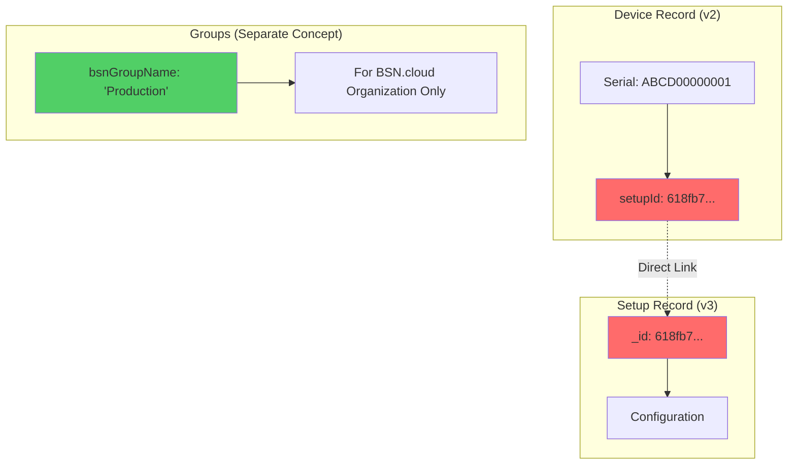
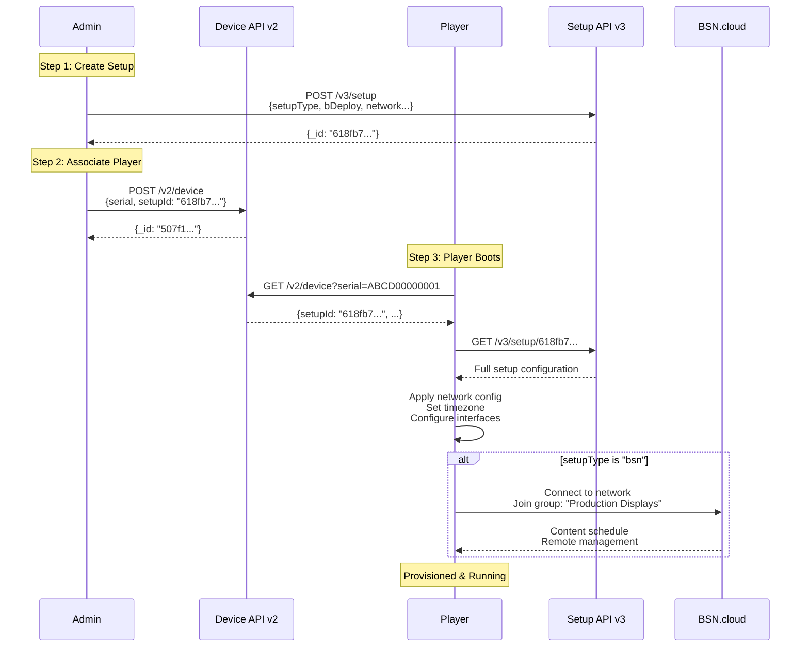

# B-Deploy Player-to-Setup Association

This document explains how BrightSign players are associated with setup configurations in the B-Deploy system.

## TL;DR

**Player-to-Setup association is DIRECT via the `setupId` field, NOT through groups.**

```
Player Serial → Device.setupId → Setup._id → Configuration
```

Groups (`bsnGroupName`) are a separate BSN.cloud feature for dashboard organization and content management, not part of the B-Deploy provisioning mechanism.

## Architecture Overview



## Two Separate Concepts

### 1. Setup Association (setupId) ✅ Core Provisioning Mechanism

The `setupId` field in the device record directly links a player to its setup configuration.

**Device Record (B-Deploy Device API v2):**
```json
{
  "_id": "507f1f77bcf86cd799439011",
  "serial": "ABCD00000001",
  "setupId": "618fb7363a682fe7a40c73ca",
  "name": "Store Display #1",
  "NetworkName": "Production",
  "model": "HD1024",
  "desc": "Main entrance display"
}
```

**Setup Record (B-Deploy Setup API v3):**
```json
{
  "_id": "618fb7363a682fe7a40c73ca",
  "version": "3.0.0",
  "setupType": "bsn",
  "bDeploy": {
    "username": "user@example.com",
    "networkName": "Production",
    "packageName": "retail-config-v1"
  },
  "network": {
    "interfaces": [...]
  }
}
```

**How It Works:**

1. Player boots with serial number `ABCD00000001`
2. Player queries B-Deploy: `GET /rest-device/v2/device/?serial=ABCD00000001`
3. B-Deploy returns device record with `setupId: "618fb7363a682fe7a40c73ca"`
4. Player fetches setup: `GET /rest-setup/v3/setup/618fb7363a682fe7a40c73ca`
5. Player auto-provisions using that configuration

### 2. BSN Groups (bsnGroupName) ℹ️ Management & Organization

The `bsnGroupName` field in the setup record is for BSN.cloud dashboard organization only.

**Setup Record with Group:**
```json
{
  "_id": "618fb7363a682fe7a40c73ca",
  "setupType": "bsn",
  "bsnGroupName": "Production Displays",
  "bDeploy": {...},
  "network": {...}
}
```

**Purpose of Groups:**
- **Dashboard Organization** - Group players in BSN.cloud UI
- **Content Scheduling** - Apply content schedules to groups
- **Bulk Management** - Perform operations on multiple players
- **Reporting & Analytics** - View metrics by group
- **Access Control** - Permission management in BSN.cloud

**NOT Used For:**
- ❌ B-Deploy provisioning
- ❌ Player-to-setup association
- ❌ Initial device configuration
- ❌ Auto-provisioning lookup

## Complete Provisioning Workflow



## Field Reference

### Device Record Fields (v2)

| Field | Type | Purpose | Required | Used By |
|-------|------|---------|----------|---------|
| `serial` | string | Player unique identifier | Yes | B-Deploy lookup |
| **`setupId`** | string | **Direct link to setup config** | **Yes** | **B-Deploy provisioning** |
| `setupName` | string | Human-readable setup name | No | Display only |
| `url` | string | Alternative direct URL provisioning | No | B-Deploy (alternative method) |
| `name` | string | Human-readable device name | Yes | Management |
| `model` | string | Player model (HD1024, etc.) | No | Inventory |
| `desc` | string | Device description | No | Documentation |
| `NetworkName` | string | BSN.cloud network name | Yes | Multi-tenancy |

### Setup Record Fields (v3)

| Field | Type | Purpose | Required | Used By |
|-------|------|---------|----------|---------|
| `_id` | string | Setup record unique identifier | Auto | B-Deploy (referenced by device.setupId) |
| `setupType` | string | Type of setup (bsn, lfn, standalone, sfn, partnerApplication) | Yes | Provisioning behavior |
| **`bsnGroupName`** | string | **BSN.cloud group for organization** | No | **BSN.cloud dashboard only** |
| `bDeploy.networkName` | string | Network name | Yes | Multi-tenancy |
| `bDeploy.packageName` | string | Setup package identifier | Yes | Management |
| `network` | object | Network interface configuration | No | Player network setup |
| `timeZone` | string | Player timezone | No | Clock configuration |

## Code Examples

### Data Structures (Go SDK)

From `internal/types/types.go`:

```go
// BDeployDevice represents a device in the B-Deploy device response.
type BDeployDevice struct {
    ID          string    `json:"_id"`
    Serial      string    `json:"serial"`      // Player identity
    SetupID     string    `json:"setupId"`     // ← Direct setup reference
    SetupName   string    `json:"setupName"`   // Human-readable name
    Name        string    `json:"name"`
    Model       string    `json:"model"`
    NetworkName string    `json:"NetworkName"`
    // ... other fields
}

// BDeploySetupRecord represents a complete B-Deploy setup record.
type BDeploySetupRecord struct {
    ID           string       `json:"_id,omitempty"`
    Version      string       `json:"version"`
    SetupType    string       `json:"setupType"`
    BSNGroupName string       `json:"bsnGroupName,omitempty"` // ← For BSN.cloud only
    BDeploy      BDeployInfo  `json:"bDeploy"`
    Network      *NetworkConfig `json:"network,omitempty"`
    // ... other fields
}
```

### Associate Player (Bash)

```bash
#!/bin/bash
# Associate player ABCD00000001 with setup 618fb7363a682fe7a40c73ca

SERIAL="ABCD00000001"
SETUP_ID="618fb7363a682fe7a40c73ca"
NETWORK="Production"

# Set network context
curl -X PUT "https://api.bsn.cloud/2022/06/REST/Self/Session/Network" \
  -H "Authorization: Bearer $BS_ACCESS_TOKEN" \
  -H "Content-Type: application/json" \
  -d "{\"name\": \"$NETWORK\"}"

# Create/update device with setupId
curl -X POST "https://provision.bsn.cloud/rest-device/v2/device/" \
  -H "Authorization: Bearer $BS_ACCESS_TOKEN" \
  -H "Content-Type: application/json" \
  -d "{
    \"serial\": \"$SERIAL\",
    \"setupId\": \"$SETUP_ID\",
    \"name\": \"Store Display #1\",
    \"NetworkName\": \"$NETWORK\"
  }"
```

### Query Player Setup (Bash)

```bash
#!/bin/bash
# Check what setup a player is associated with

SERIAL="ABCD00000001"

curl -X GET "https://provision.bsn.cloud/rest-device/v2/device/?serial=$SERIAL" \
  -H "Authorization: Bearer $BS_ACCESS_TOKEN" \
  | jq '.result.players[0] | {serial, setupId, setupName}'

# Output:
# {
#   "serial": "ABCD00000001",
#   "setupId": "618fb7363a682fe7a40c73ca",
#   "setupName": "retail-config-v1"
# }
```

## Common Scenarios

### Scenario 1: New Player, Existing Setup

You have a setup record and want to add a new player to it.

```bash
./scripts/bdeploy-associate-player.sh \
  --serial "NEW00000001" \
  --setup-id "618fb7363a682fe7a40c73ca" \
  --network "Production"
```

**Result:** Player will provision with the existing setup configuration.

### Scenario 2: Reassign Player to Different Setup

Move a player from one setup to another (e.g., relocating from Store A to Store B).

```bash
# Player currently on setup ABC123, moving to DEF456
./scripts/bdeploy-associate-player.sh \
  --serial "ABCD00000001" \
  --setup-id "def456789012345678901234" \
  --network "Production"
```

**Result:** Player will re-provision with new setup on next boot.

### Scenario 3: Multiple Players, Same Setup

Associate many players to the same setup configuration (e.g., rolling out standard config to 100 displays).

```bash
SETUP_ID="618fb7363a682fe7a40c73ca"
NETWORK="Production"

for SERIAL in $(cat player-serials.txt); do
  ./scripts/bdeploy-associate-player.sh \
    --serial "$SERIAL" \
    --setup-id "$SETUP_ID" \
    --network "$NETWORK"
done
```

**Result:** All players get identical configuration, but maintain individual identities.

### Scenario 4: One Player, Multiple Setups Over Time

A player may be reassociated with different setups during its lifecycle.

```bash
# Initial deployment - Store A config
./scripts/bdeploy-associate-player.sh \
  --serial "ABCD00000001" \
  --setup-id "store-a-config-id" \
  --network "Production"

# Later: Move to Store B
./scripts/bdeploy-associate-player.sh \
  --serial "ABCD00000001" \
  --setup-id "store-b-config-id" \
  --network "Production"

# Later: Return to warehouse for re-imaging
./scripts/bdeploy-associate-player.sh \
  --serial "ABCD00000001" \
  --setup-id "warehouse-staging-id" \
  --network "Production"
```

## Relationship Matrix

| Entity | Contains | Links To | Purpose |
|--------|----------|----------|---------|
| **Device Record** | `serial`, `setupId` | Setup Record (_id) | Maps player to configuration |
| **Setup Record** | `_id`, config, `bsnGroupName` | Nothing (terminal) | Defines player configuration |
| **BSN Group** | Players (after provisioning) | N/A | Organizes players in BSN.cloud |

## API Endpoints

### Device API v2 (Association)

**Base URL:** `https://provision.bsn.cloud/rest-device/v2/device/`

```bash
# List all devices
GET /rest-device/v2/device/

# Get device by serial (shows setupId)
GET /rest-device/v2/device/?serial=ABCD00000001

# Create device with setupId
POST /rest-device/v2/device/
{
  "serial": "ABCD00000001",
  "setupId": "618fb7363a682fe7a40c73ca",
  "name": "Display Name",
  "NetworkName": "Production"
}

# Update device setupId
PUT /rest-device/v2/device/?_id=507f1f77bcf86cd799439011
{
  "_id": "507f1f77bcf86cd799439011",
  "setupId": "NEW_SETUP_ID",
  ...
}

# Delete device association
DELETE /rest-device/v2/device/?serial=ABCD00000001
```

### Setup API v3 (Configuration)

**Base URL:** `https://provision.bsn.cloud/rest-setup/v3/setup/`

```bash
# List setups (with bsnGroupName for organization)
GET /rest-setup/v3/setup?NetworkName=Production

# Get specific setup
GET /rest-setup/v3/setup/618fb7363a682fe7a40c73ca

# Create setup
POST /rest-setup/v3/setup
{
  "version": "3.0.0",
  "setupType": "bsn",
  "bsnGroupName": "Production Displays",
  "bDeploy": {...},
  "network": {...}
}
```

## Comparison: setupId vs bsnGroupName

| Aspect | `setupId` (Device) | `bsnGroupName` (Setup) |
|--------|-------------------|------------------------|
| **API** | Device API v2 | Setup API v3 |
| **Purpose** | Link player to config | Organize in BSN.cloud |
| **Used During** | Provisioning | Post-provisioning |
| **Required For** | Auto-provisioning | No (optional) |
| **Cardinality** | 1 device → 1 setup | Many setups → 1 group |
| **Can Change** | Yes (reassociate) | Yes (edit setup) |
| **Player Lookup** | Yes (direct) | No (indirect) |
| **BSN.cloud Feature** | No | Yes |

## Troubleshooting

### Player Not Auto-Provisioning

**Check the association:**
```bash
# Verify device has setupId
curl -X GET "https://provision.bsn.cloud/rest-device/v2/device/?serial=ABCD00000001" \
  -H "Authorization: Bearer $BS_ACCESS_TOKEN" \
  | jq '.result.players[0].setupId'

# Should output: "618fb7363a682fe7a40c73ca"
# If null or missing, association was not created
```

**Fix:**
```bash
./scripts/bdeploy-associate-player.sh \
  --serial "ABCD00000001" \
  --setup-id "618fb7363a682fe7a40c73ca" \
  --network "Production"
```

### Player Provisioning with Wrong Config

**Check which setup it's using:**
```bash
# Get current setupId
CURRENT_SETUP=$(curl -s -X GET \
  "https://provision.bsn.cloud/rest-device/v2/device/?serial=ABCD00000001" \
  -H "Authorization: Bearer $BS_ACCESS_TOKEN" \
  | jq -r '.result.players[0].setupId')

echo "Current setup: $CURRENT_SETUP"

# Get setup details
curl -X GET "https://provision.bsn.cloud/rest-setup/v3/setup/$CURRENT_SETUP" \
  -H "Authorization: Bearer $BS_ACCESS_TOKEN" \
  | jq '{setupType, packageName: .bDeploy.packageName, group: .bsnGroupName}'
```

**Fix:** Reassociate with correct setup

### "Player in Wrong Group" (BSN.cloud)

This is a **post-provisioning** issue, not a B-Deploy association issue.

- B-Deploy uses `setupId` for provisioning
- BSN.cloud uses `bsnGroupName` for organization
- Group membership is determined by the setup's `bsnGroupName` field
- To change group: edit the setup record or create a new setup with different group

## Best Practices

### 1. Use Descriptive Setup Package Names

```json
{
  "bDeploy": {
    "packageName": "store-front-v2-wifi-logging",
    "networkName": "Production"
  },
  "bsnGroupName": "Store Front Displays"
}
```

### 2. Maintain Setup-to-Group Mapping

Create a naming convention:

| Setup Package | BSN Group | Purpose |
|---------------|-----------|---------|
| `store-front-v1` | `Store Front Displays` | Public-facing displays |
| `store-back-v1` | `Back Office` | Internal displays |
| `kiosk-standard-v1` | `Kiosks` | Interactive kiosks |

### 3. Document Reassociation Events

```bash
# Log associations for audit trail
echo "$(date): Serial $SERIAL reassociated from $OLD_SETUP to $NEW_SETUP" \
  >> /var/log/bdeploy-associations.log
```

### 4. Validate Setup Exists Before Association

```bash
# Check setup exists
SETUP_EXISTS=$(curl -s -X GET \
  "https://provision.bsn.cloud/rest-setup/v3/setup/$SETUP_ID" \
  -H "Authorization: Bearer $BS_ACCESS_TOKEN" \
  | jq -r '.result._id')

if [ "$SETUP_EXISTS" = "$SETUP_ID" ]; then
  # Proceed with association
else
  echo "Error: Setup $SETUP_ID does not exist"
fi
```

## Related Documentation

- **[B-Deploy API Documentation](b-deploy.md)** - Complete API reference
- **[Setup Types Reference](setup-types.md)** - All 7 setup types explained
- **[Associate Player Example](../examples/associate-player-to-setup/)** - Code examples
- **[BSN.cloud API Guide](https://docs.brightsign.biz/developers/2025-api-usage-guide)** - Official documentation

## Summary

**Key Takeaway:** Player-to-setup association is a **direct 1:1 relationship** via the `setupId` field in the device record. Groups are a separate organizational feature in BSN.cloud for content management and dashboard organization.

```
✅ Correct Understanding:
   Device.setupId → Setup._id (Direct link for provisioning)
   Setup.bsnGroupName → BSN Group (Organizational only)

❌ Common Misconception:
   Device → Group → Setup (This is NOT how it works)
```

When associating players, always think: **Serial Number → setupId → Configuration**
