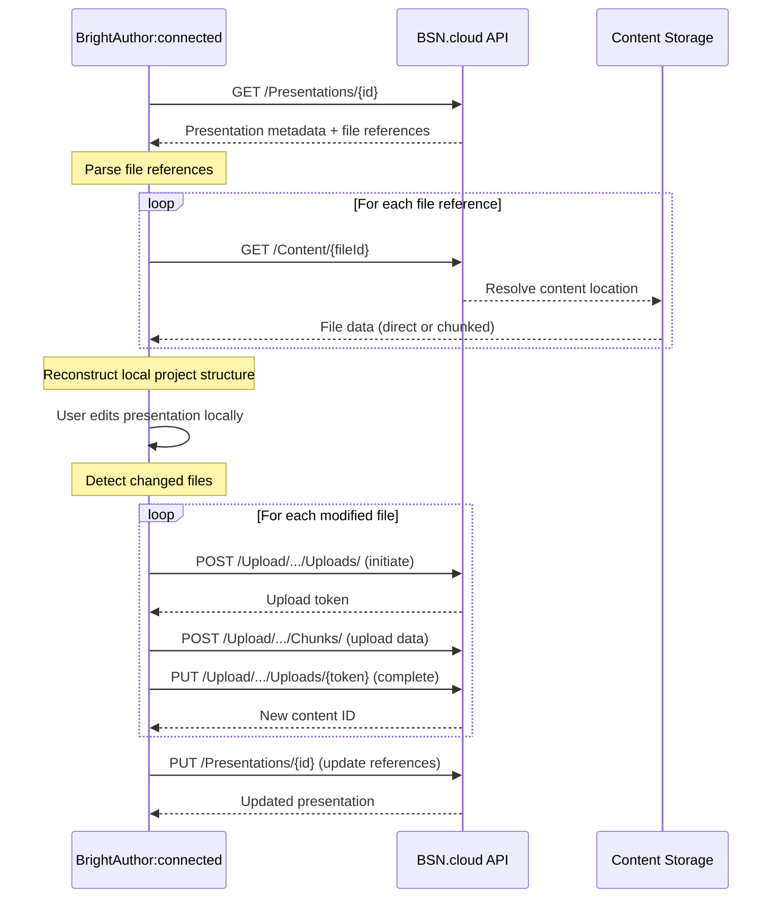

# Presentation Download Workflow

## Overview

This document describes how BrightAuthor:connected (BA:con) downloads presentations from BSN.cloud for local editing. There is no single "download presentation" endpoint - instead, presentations are downloaded file-by-file using a metadata-first approach.

## Download Workflow

### 1. Retrieve Presentation Metadata

**Endpoint:** `GET /2022/06/REST/Presentations/{id}`

**Purpose:** Get the presentation structure and references to all component files.

The API returns a presentation object containing:
- **Basic metadata**: name, description, creation date, publish state
- **File references**:
  - `projectFile` - Main BrightAuthor project file (.bpfx)
  - `autoplayFile` - Autoplay.brs script
  - `resourcesFile` - Resources archive
  - `userDefinedEventsFile` - Custom event definitions
  - `thumbnailFile` - Preview image
- **Asset collections**:
  - `files[]` - Media assets (videos, images, audio)
  - `applications[]` - HTML/Node.js applications
  - `dependencies[]` - Font and library dependencies
- **Configuration**:
  - `autorun` - Player firmware version and settings
  - `screenSettings` - Video mode, orientation, connector, colors
  - `deviceModel` - Target player hardware

**Example Response Structure:**
```json
{
  "id": 12345,
  "name": "Retail Display",
  "type": "Standard",
  "projectFile": {
    "id": 98765,
    "name": "project.bpfx",
    "virtualPath": "\\Presentations\\Retail Display\\",
    "size": 45632
  },
  "files": [
    {
      "id": 11111,
      "name": "welcome-video.mp4",
      "virtualPath": "\\Shared\\Videos\\",
      "mediaType": "Video",
      "size": 52428800
    },
    {
      "id": 22222,
      "name": "background.jpg",
      "virtualPath": "\\Shared\\Images\\",
      "mediaType": "Image",
      "size": 1024000
    }
  ],
  "autorun": {
    "version": "10.0.98",
    "isCustom": false
  },
  "screenSettings": {
    "videoMode": "1920x1080x60p",
    "orientation": "Landscape",
    "connector": "HDMI"
  }
}
```

### 2. Download Individual Files

**Endpoint:** `GET /2022/06/REST/Content/{id}`

**Purpose:** Download the actual file data for each component referenced in the presentation.

For each file reference obtained in step 1, BA:con makes a separate request to download:

- **Project file** (`projectFile.id`) - XML configuration defining zones, playlists, events
- **Media assets** (`files[].id`) - Videos, images, audio files
- **Script files** (`autoplayFile.id`) - BrightScript code
- **Applications** (`applications[].id`) - HTML apps, Node.js apps
- **Dependencies** (`dependencies[].id`) - Fonts, libraries, plugins
- **Resources** (`resourcesFile.id`) - Packaged resource bundles
- **Thumbnail** (`thumbnailFile.id`) - Preview image

**Download Strategy:**

For large files, the Upload API's chunked transfer mechanism works in reverse:

```http
GET /2022/06/REST/Content/{id}
Authorization: Bearer {token}
Accept: application/octet-stream
```

The API may return:
- Small files: Complete file in response body
- Large files: Chunked transfer or redirect to CDN URL

### 3. Reconstruct Local Project

BA:con assembles the downloaded files into a local project structure:

```
MyPresentation/
├── project.bpfx              # Main project file (XML)
├── autoplay.brs              # Player script (BrightScript)
├── resources/                # Media files
│   ├── videos/
│   │   ├── welcome-video.mp4
│   │   └── product-demo.mp4
│   ├── images/
│   │   ├── background.jpg
│   │   ├── logo.png
│   │   └── menu-icons.png
│   └── audio/
│       └── background-music.mp3
├── apps/                     # HTML applications
│   └── interactive-menu/
│       ├── index.html
│       ├── app.js
│       └── style.css
├── libraries/                # Dependencies
│   └── custom-fonts/
└── thumbnail.jpg             # Preview image
```

### 4. Track File Metadata

BA:con maintains a mapping between local files and BSN.cloud content IDs to enable:
- **Upload detection** - Identify which files changed locally
- **Sync operations** - Push modified files back to BSN.cloud
- **Version tracking** - Compare local vs. cloud file dates/hashes

## Presentation Upload Workflow

When uploading a modified presentation back to BSN.cloud:

### 1. Update Presentation Metadata

**Endpoint:** `PUT /2022/06/REST/Presentations/{id}`

Update presentation properties like name, description, screen settings, etc.

### 2. Upload Changed Files

For each modified file, use the Upload API workflow:

**a. Initiate Upload:**
```http
POST /Upload/2019/03/REST/Sessions/None/Uploads/
Content-Type: application/vnd.bsn.start.content.upload.arguments.201903+json

{
  "fileName": "video.mp4",
  "virtualPath": "\\Shared\\Videos\\",
  "mediaType": "Video",
  "fileSize": 52428800,
  "sha1Hash": "abc123..."
}
```

**b. Upload File Chunks:**
```http
POST /Upload/2019/03/REST/Sessions/None/Uploads/{uploadToken}/Chunks/?offset=0
Content-Type: application/octet-stream

[binary data]
```

**c. Complete Upload:**
```http
PUT /Upload/2019/03/REST/Sessions/None/Uploads/{uploadToken}/
Content-Type: application/vnd.bsn.complete.content.upload.arguments.201903+json

{
  "fileName": "video.mp4",
  "virtualPath": "\\Shared\\Videos\\",
  "fileSize": 52428800,
  "sha1Hash": "abc123..."
}
```

### 3. Update Presentation References

After uploading new/modified files, update the presentation to reference the new content IDs:

```http
PUT /2022/06/REST/Presentations/{id}

{
  "files": [
    { "id": 11111, "name": "welcome-video.mp4" },
    { "id": 33333, "name": "new-video.mp4" }  // New file
  ]
}
```

## Workflow Diagram



## API Endpoints Summary

| Operation | Endpoint | Purpose |
|-----------|----------|---------|
| Get presentation | `GET /Presentations/{id}` | Retrieve presentation metadata and file references |
| Get content file | `GET /Content/{id}` | Download individual content file |
| Update presentation | `PUT /Presentations/{id}` | Modify presentation metadata |
| Initiate upload | `POST /Upload/.../Uploads/` | Start file upload session |
| Upload chunk | `POST /Upload/.../Chunks/?offset=N` | Upload file data in chunks |
| Complete upload | `PUT /Upload/.../Uploads/{token}` | Finalize upload and get content ID |

## Current SDK Implementation Status

### Implemented
- ✅ `GET /Presentations/` - List presentations
- ✅ `GET /Presentations/{id}` - Get presentation by ID
- ✅ `GET /Presentations/{name}` - Get presentation by name
- ✅ `POST /Presentations/` - Create new presentation
- ✅ `DELETE /Presentations/{id}` - Delete presentation
- ✅ `DELETE /Presentations/?filter=` - Bulk delete presentations
- ✅ `POST /Upload/` - Upload content files

### Not Yet Implemented
- ❌ `GET /Content/{id}` - Download content file
- ❌ `PUT /Presentations/{id}` - Update presentation
- ❌ Chunked download support for large files
- ❌ Upload session management (initiate, chunk, complete workflow)

## Key Implementation Notes

1. **No atomic download** - Presentations are not downloaded as a single package. Each component must be fetched separately.

2. **Content ID mapping** - File references use content IDs, not file paths. BA:con must maintain a mapping between local files and their BSN.cloud content IDs.

3. **Deduplication** - BSN.cloud detects duplicate files via SHA1 hash. If uploading a file that already exists, the API returns the existing content ID instead of storing a duplicate.

4. **Virtual paths** - Files are organized in a virtual folder structure (e.g., `\\Shared\\Videos\\`). Multiple files with the same name can exist if they're in different virtual paths.

5. **Large files** - Files over a certain size threshold use chunked transfer for both upload and download to handle network interruptions and progress tracking.

6. **Presentation state** - Presentations have a `publishState` (Draft, Published) that affects whether they can be assigned to players.

## See Also

- [docs/all-apis.md](all-apis.md) - Complete API endpoint reference
- [docs/api-guide.md](api-guide.md) - API usage guide
- [external/bsn-cloud-update.md](../external/bsn-cloud-update.md) - Detailed upload workflow documentation
