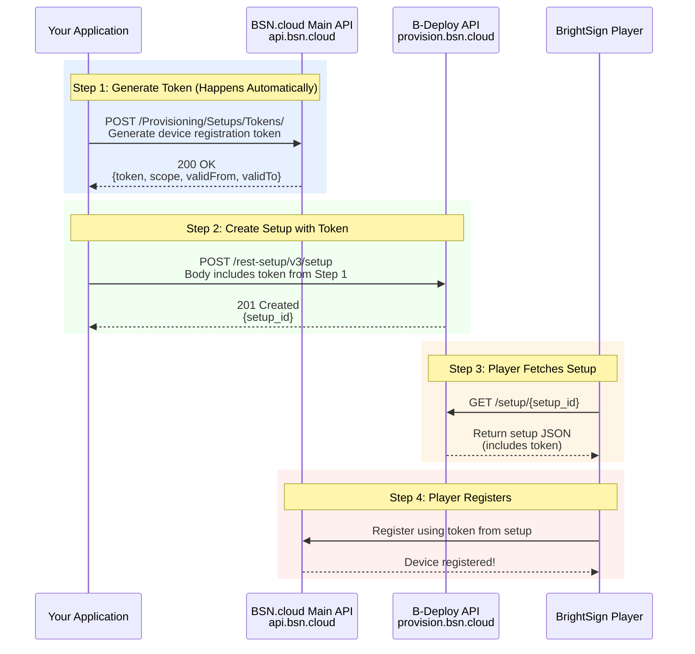
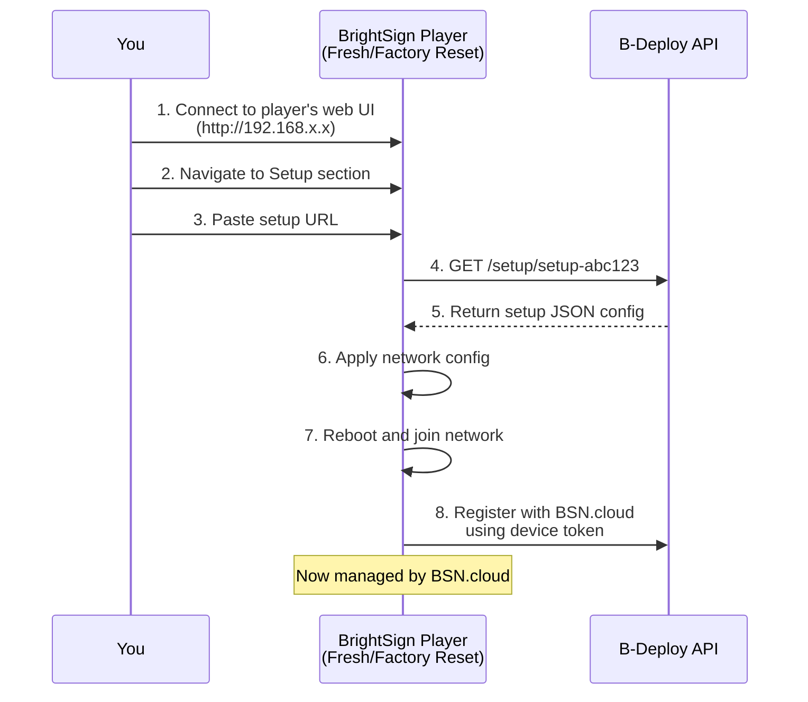
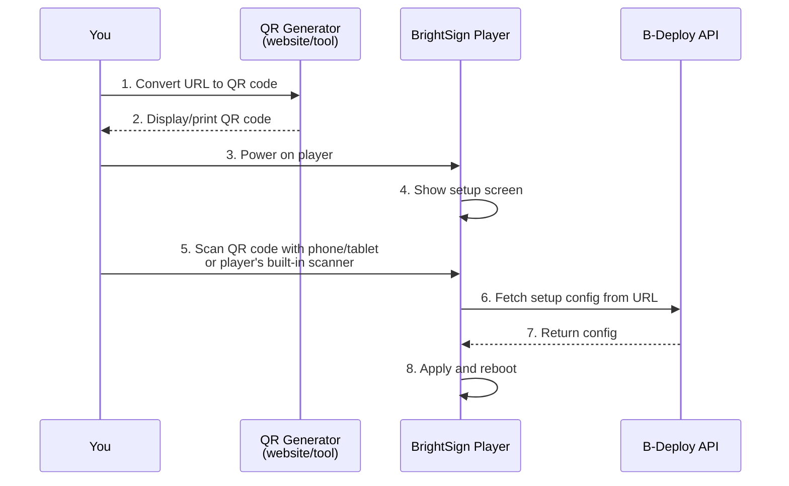
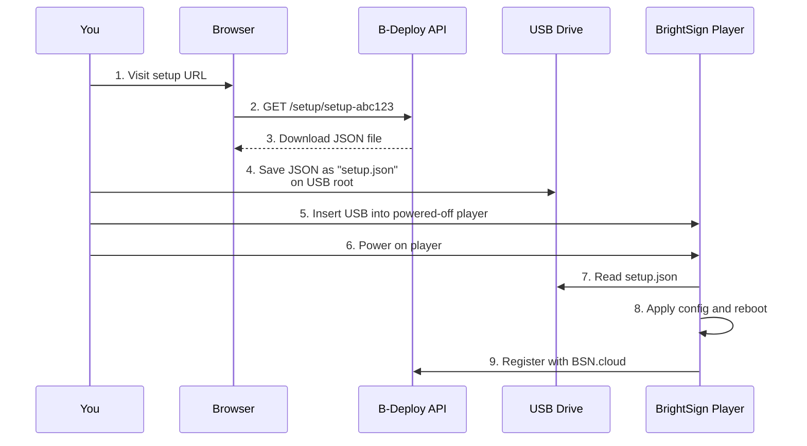

# Add Setup to B-Deploy Example

Creates a B-Deploy setup record using JSON configuration. This program generates the setup-id that you'll need to associate players with the setup configuration.

**What This Program Does:**
- Creates a B-Deploy setup record with network configuration, timezone, and device registration tokens
- Outputs a setup-id for use with the `associate-player-with-setup` example
- Provides setup URLs for direct player provisioning (QR code, web UI, USB)

**What This Program Does NOT Do:**
- Does not associate existing players with the setup (use `associate-player-with-setup` for that)
- Does not wait for players to register

## Quick Start

```bash
# Build all examples
make build-examples

# Set your credentials
export BS_CLIENT_ID="your-client-id"
export BS_SECRET="your-client-secret"

# Run with default config
./bin/bdeploy-add-setup examples/bdeploy-add-setup/config.json
```

## Configuration Files

### config.json
Basic configuration template. Device registration tokens are **automatically generated** by the program each time it runs. Use this as your starting point.

### config-annotated.json
Detailed inline documentation for every configuration field. Review this to understand all available options.

**Note:** This file includes `_comment` fields for documentation. These are ignored by the program but you may want to remove them in your production configs.

### config-wifi-example.json
WiFi networking example. Shows how to:
- Configure WiFi interface instead of Ethernet
- Use multiple time servers

## Configuration Reference

### Required Fields

```json
{
  "networkName": "Your Network Name",
  "username": "your@email.com",
  "packageName": "unique-setup-name",
  "setupType": "standalone",
  "network": {
    "interfaces": [...]
  }
}
```

- `networkName` - BSN.cloud network name (must match exactly)
- `username` - Your BSN.cloud username/email
- `packageName` - Unique identifier for this setup configuration
- `setupType` - Setup type: `standalone` or `bsn`
- `network.interfaces` - At least one network interface configuration

**Note:** Device registration tokens are **automatically generated** - no need to include them in config.

### Optional Fields

- `timeZone` - Player timezone (default: "America/New_York")
- `bsnGroupName` - BSN group assignment (default: "Default")
- `timeout` - HTTP request timeout in seconds (default: 30)

## Workflow Steps

The program automatically performs these steps:

1. **Load & Validate Config** - Parse JSON and check required fields
2. **Authenticate** - OAuth2 with BSN.cloud
3. **Verify Network** - Check network exists and is accessible
4. **Set Network Context** - Configure B-Deploy for target network
5. **Generate Device Token** - Auto-generate registration token via BSN.cloud Provisioning API
6. **Create Setup Record** - Generate B-Deploy configuration with embedded token
7. **Output Setup-ID** - Display the setup-id and provisioning URLs

## Device Registration Tokens: The Key to Player Provisioning

### What is a Device Registration Token?

A device registration token is a **cryptographic credential** that authorizes BrightSign players to register with your BSN.cloud network. It's like a secure invitation code that players use to join your network during provisioning.

### Why Tokens Are Required

The B-Deploy API **requires** a device registration token in every setup record because:

1. **Security** - Only players with valid tokens can join your network
2. **Authorization** - Tokens are network-scoped and time-limited
3. **Control** - You can revoke tokens to block new registrations
4. **Flexibility** - Reuse one token across multiple setups

### Two Separate APIs Are Involved

Device provisioning involves **two distinct BSN.cloud APIs**:



### API Call Details

#### API #1: BSN.cloud Main API - Generate Token

**Endpoint:**
```
POST https://api.bsn.cloud/2020/10/REST/Provisioning/Setups/Tokens/
```

**Required Permissions:**
- Scope: `bsn.api.main.devices.setups.token.create`
- Authorization: OAuth2 Bearer token (your user access token)

**What It Does:**
Generates a new device registration token for your current network. The token is valid for 2 years by default with `cert` scope, allowing multiple devices to use it.

**Response:**
```json
{
  "token": "cW7OQJPG21d3ao1wDzpUXTKMn2dyog7A...",
  "scope": "cert",
  "validFrom": "2025-01-01T00:00:00Z",
  "validTo": "2027-01-01T00:00:00Z"
}
```

**SDK Method:**
```go
deviceToken, err := client.Provisioning.GenerateDeviceToken(ctx)
```

#### API #2: B-Deploy API - Create Setup

**Endpoint:**
```
POST https://provision.bsn.cloud/rest-setup/v3/setup
```

**Required Field:**
```json
{
  "bsnDeviceRegistrationTokenEntity": {
    "token": "cW7OQJPG21d3ao1wDzpUXTKMn2dyog7A...",
    "scope": "cert",
    "validFrom": "2025-01-01T00:00:00Z",
    "validTo": "2027-01-01T00:00:00Z"
  }
}
```

**What It Does:**
Stores the token inside the setup configuration. B-Deploy doesn't validate the token - it just stores it for players to retrieve later.

### Automatic Token Generation

This program **always automatically generates** device registration tokens via the BSN.cloud Provisioning API.

**Behavior:**
- Each run calls `POST /Provisioning/Setups/Tokens/` to generate a fresh token
- Tokens are valid for 2 years by default
- Tokens have `cert` scope (can register multiple devices)
- No manual token management required

**Example:**
```
Run 1: Generate token → Create setup → Deploy players
Run 2: Generate token → Create setup → Deploy players
...
Each setup gets its own unique token automatically
```

### Token Scopes

- **`cert`** (Certificate scope)
  - Can register multiple devices
  - Typical validity: 2 years
  - Use for production deployments

- **`device`** (Single device scope)
  - Registers one device only
  - More restrictive
  - Use for tightly controlled environments

### What Happens During Player Registration

When a player boots with your setup:

1. **Player fetches setup** from B-Deploy (contains token)
2. **Player extracts token** from setup JSON
3. **Player calls BSN.cloud** Main API with token
4. **BSN.cloud validates**:
   - Token signature (cryptographically signed)
   - Token not expired (validFrom/validTo)
   - Token scope permits registration
   - Network still active
5. **BSN.cloud registers player** to network
6. **Player appears** in device lists

### Why B-Deploy Doesn't Generate Tokens

B-Deploy is a **"dumb storage"** layer that:
- ✅ Stores setup configurations
- ✅ Distributes them to players
- ❌ **Does NOT** manage authorization or security

BSN.cloud Main API handles:
- ✅ Token generation
- ✅ Token validation
- ✅ Device authorization
- ✅ Network permissions

This **separation of concerns** provides:
- **Flexibility** - Reuse tokens across setups
- **Security** - Centralized token management
- **Control** - Revoke tokens to block registrations

## Understanding the Setup URL

When you run the program, it creates a setup record in B-Deploy and outputs a URL like:

```
https://provision.bsn.cloud/setup/setup-abc123def456
```

This URL points to a JSON configuration file that tells the player:
- Which BSN.cloud network to join
- Network settings (DHCP, static IP, WiFi credentials, etc.)
- Device registration token to authenticate with BSN.cloud
- Time zone, time servers, and other settings

### What's in the Setup Config?

When the player fetches the URL, it gets JSON like this:

```json
{
  "version": "3.0.0",
  "bDeploy": {
    "username": "admin@example.com",
    "networkName": "Production Network",
    "packageName": "retail-display-v1"
  },
  "setupType": "standalone",
  "bsnDeviceRegistrationTokenEntity": {
    "token": "reg-token-abc123",
    "scope": "cert",
    "validFrom": "2025-01-01T00:00:00Z",
    "validTo": "2026-01-01T00:00:00Z"
  },
  "network": {
    "interfaces": [{
      "id": "wired_eth0",
      "name": "eth0",
      "type": "Ethernet",
      "proto": "DHCPv4"
    }],
    "timeServers": ["time.brightsignnetwork.com"]
  },
  "timeZone": "America/New_York",
  "bsnGroupName": "Default"
}
```

The player downloads this config, applies the network settings, and uses the device token to register with BSN.cloud.

## Player Provisioning Methods

After setup creation, provision your player using any of these methods. The setup URL is the **bridge** between your cloud configuration and the physical device.

### Method 1: Web Interface (Manual Entry)

**When to use:** Individual player setup, troubleshooting, or when you have network access to the player.

**Flow:**



**Steps:**
1. Power on the player
2. Access player's web interface (typically http://player-ip or http://192.168.x.x)
3. Navigate to Setup or Configuration section
4. Enter the setup URL provided by the program
5. Player downloads config, applies it, and reboots
6. After reboot, player registers with BSN.cloud

### Method 2: QR Code (Fastest for Field Installers)

**When to use:** Mass deployments, field installations, or when you want installers to provision without typing long URLs.

**Flow:**



**Steps:**
1. Take the setup URL from program output
2. Generate QR code using a website (e.g., qr-code-generator.com) or tool
3. Print QR codes on stickers or display on a tablet
4. Power on the player
5. Player shows setup screen
6. Scan QR code with phone/tablet or use player's built-in scanner
7. Player automatically downloads, applies config, and registers

**Pro tip:** Print multiple QR code stickers from one setup URL and use them for identical player configurations across multiple locations.

### Method 3: USB Storage (Offline Provisioning)

**When to use:** Locations without network access during setup, pre-staging equipment, or offline deployments.

**Flow:**



**Steps:**
1. Visit the setup URL in your web browser
2. Browser will download or display the JSON configuration
3. Save the JSON file as `setup.json` on the root of a USB drive
4. Insert USB drive into powered-off BrightSign player
5. Power on the player
6. Player reads `setup.json` from USB
7. Player applies configuration and reboots
8. Once online, player registers with BSN.cloud using the device token

## Why This Matters

The setup URL workflow enables:

1. **Program creates setup** → Stored in B-Deploy cloud
2. **Setup URL generated** → Points to that config
3. **Player uses URL** → Downloads and applies config
4. **Player registers** → Uses the device token to join BSN.cloud
5. **Player managed** → Now appears in device lists and can be controlled remotely

## Real-World Deployment Example

**Scenario:** Deploying 100 retail displays across 50 locations

1. **Create Configuration** - Run the program once with your network settings
2. **Get Setup URL** - Receive `https://provision.bsn.cloud/setup/setup-xyz789`
3. **Generate QR Codes** - Create QR code from the URL
4. **Print Stickers** - Print 100 QR code stickers (or display on tablets)
5. **Ship to Locations** - Send players with QR code stickers to installers
6. **Field Installation** - At each location:
   - Mount player
   - Connect power and network
   - Power on player
   - Scan QR code
   - Wait 2 minutes for auto-configuration
   - Done!

**Result:** All 100 players get identical configuration from one setup record. No manual configuration at each location. No typing. No errors.

## Example Output

```
📋 Loading configuration from: config.json

🔧 Creating BSN.cloud client...
🔐 Authenticating with BSN.cloud...
✅ Authentication successful!

📡 Setting network context to: Production Network
✅ Network context set successfully!

🔑 Generating device registration token...
✅ Device registration token generated successfully!

📝 Creating B-Deploy setup record...
✅ B-Deploy setup record created successfully!

======================================================================
SETUP-ID: setup-abc123def456
======================================================================
Save this setup-id - you'll need it to associate players with this setup

🔗 Setup URLs:
   Web: https://provision.bsn.cloud/setup/setup-abc123def456
   API: https://provision.bsn.cloud/rest-setup/v3/setup/setup-abc123def456

📱 Next Steps:
   Option 1: Associate existing players with this setup
     Use the associate-player-with-setup example with the setup-id above

   Option 2: Provision new players directly
     - Enter the setup URL in the player's web interface
     - Generate a QR code from the URL and scan it with the player
     - Load the setup configuration via USB storage

🎉 Setup record created successfully!
```

## Network Interface Examples

### Ethernet (DHCP)
```json
{
  "id": "wired_eth0",
  "name": "eth0",
  "type": "Ethernet",
  "proto": "DHCPv4",
  "contentDownloadEnabled": true,
  "healthReportingEnabled": true
}
```

### WiFi (DHCP)
```json
{
  "id": "wifi",
  "name": "wlan0",
  "type": "WiFi",
  "proto": "DHCPv4",
  "contentDownloadEnabled": true,
  "healthReportingEnabled": true
}
```

### Multiple Interfaces
```json
{
  "interfaces": [
    {
      "id": "wired_eth0",
      "name": "eth0",
      "type": "Ethernet",
      "proto": "DHCPv4",
      "contentDownloadEnabled": true,
      "healthReportingEnabled": true
    },
    {
      "id": "wifi",
      "name": "wlan0",
      "type": "WiFi",
      "proto": "DHCPv4",
      "contentDownloadEnabled": false,
      "healthReportingEnabled": true
    }
  ]
}
```

## Troubleshooting

### Authentication Failed
- Verify BS_CLIENT_ID and BS_SECRET are set correctly
- Check credentials have proper permissions in BSN.cloud

### Network Not Found
- Ensure networkName matches exactly (case-sensitive)
- Run with `--verbose` to see available networks
- Verify your account has access to the network

### Setup Creation Failed
- Check that username matches your BSN.cloud login
- Ensure network context was set successfully
- Verify OAuth2 credentials have permission to generate device tokens

## Command Line Options

```
--help          Show usage information
--verbose       Show detailed progress and diagnostic info
--timeout N     Set HTTP timeout to N seconds (overrides config)
```

## Environment Variables

- `BS_CLIENT_ID` - BSN.cloud OAuth2 client ID (required)
- `BS_SECRET` - BSN.cloud OAuth2 client secret (required)

## Related Documentation

- Complete workflow guide: `/docs/add-player-to-bsn-content.md`
- Main examples README: `/examples/README.md`
- API documentation: `/README.md`
