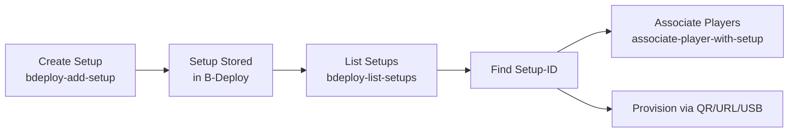

# List B-Deploy Setups Example

Lists all B-Deploy setup records for a specified network, displaying the setup-id, package name, setup type, and network name.

## Overview

This program queries the B-Deploy API to retrieve all setup records associated with a network. Setup records define the configuration that BrightSign players use when provisioning, including network settings, timezone, and device registration tokens.

**Use Cases:**
- View all available setup configurations for a network
- Find the setup-id for use with player association
- Audit setup configurations across your deployment
- Filter setups by username or package name
- Verify setup records were created correctly

## Quick Start

```bash
# Build all examples
make build-examples

# Set your credentials
export BS_CLIENT_ID="your-client-id"
export BS_SECRET="your-client-secret"

# List all setups for a network
./bin/bdeploy-list-setups --network "Production Network"
```

## Command Line Options

### Required Flags

- `--network NAME` - Network name to query (must match exactly, case-sensitive)

### Optional Flags

- `--username EMAIL` - Filter results by username (e.g., "admin@example.com")
- `--package NAME` - Filter results by package name (e.g., "retail-display-v1")
- `--verbose` - Show detailed information for each setup record
- `--help` - Display usage information

## Usage Examples

### Basic Usage

List all setups for a network:

```bash
./bin/bdeploy-list-setups --network "Production Network"
```

**Output:**
```
🔧 Creating BSN.cloud client...
🔐 Authenticating with BSN.cloud...
✅ Authentication successful!
📡 Setting network context to: Production Network
✅ Network context set successfully!

📋 Retrieving setup records...

✅ Found 3 setup record(s)

SETUP-ID                          PACKAGE NAME              SETUP TYPE       NETWORK
----------------------------------------   ------------------------------   ---------------   --------------------
setup-abc123def456                retail-display-v1         standalone       Production Network
setup-xyz789ghi012                warehouse-display-v2      standalone       Production Network
setup-jkl345mno678                conference-room-v1        bsn              Production Network
```

### Filter by Username

Show only setups created by a specific user:

```bash
./bin/bdeploy-list-setups --network "Production Network" --username "admin@example.com"
```

### Filter by Package Name

Find a specific setup package:

```bash
./bin/bdeploy-list-setups --network "Production Network" --package "retail-display-v1"
```

### Verbose Output

Get detailed information about each setup:

```bash
./bin/bdeploy-list-setups --network "Production Network" --verbose
```

**Verbose Output:**
```
Setup Record #1:
  Setup-ID:     setup-abc123def456
  Package Name: retail-display-v1
  Setup Type:   standalone
  Network:      Production Network
  Username:     admin@example.com
  Created:      2025-01-01T10:30:00Z
  Updated:      2025-01-15T14:22:00Z
  Active:       true
  Setup URL:    https://provision.bsn.cloud/setup/setup-abc123def456

Setup Record #2:
  Setup-ID:     setup-xyz789ghi012
  Package Name: warehouse-display-v2
  Setup Type:   standalone
  Network:      Production Network
  Username:     warehouse-admin@example.com
  Created:      2025-01-10T08:15:00Z
  Updated:      2025-01-10T08:15:00Z
  Active:       true
  Setup URL:    https://provision.bsn.cloud/setup/setup-xyz789ghi012
```

## Output Fields

### Standard Table Output

| Field | Description |
|-------|-------------|
| **SETUP-ID** | Unique identifier for the setup record. Use this with `associate-player-with-setup` |
| **PACKAGE NAME** | Unique name identifying this setup configuration |
| **SETUP TYPE** | Type of setup: `standalone` (independent player) or `bsn` (BSN-managed content) |
| **NETWORK** | BSN.cloud network name this setup belongs to |

### Verbose Output Additional Fields

| Field | Description |
|-------|-------------|
| **Username** | BSN.cloud user who created the setup |
| **Created** | When the setup record was created (ISO 8601 timestamp) |
| **Updated** | When the setup record was last modified (ISO 8601 timestamp) |
| **Active** | Whether the setup record is active (`true` or `false`) |
| **Setup URL** | Direct URL for player provisioning via QR code, web UI, or USB |

## Workflow Integration

### Finding Setup-IDs for Player Association

Use this program to find the setup-id you need for the `associate-player-with-setup` example:

```bash
# Step 1: List setups to find the one you want
./bin/bdeploy-list-setups --network "Production Network"

# Step 2: Copy the setup-id from the output
# Step 3: Use it with associate-player-with-setup
./bin/associate-player-with-setup --setup-id "setup-abc123def456" --serial "BS123456789"
```

### Auditing Setup Configurations

Regularly list setups to audit your deployment:

```bash
# Check all setups in production
./bin/bdeploy-list-setups --network "Production Network" --verbose > production-setups.txt

# Compare with staging
./bin/bdeploy-list-setups --network "Staging Network" --verbose > staging-setups.txt

# Review differences
diff production-setups.txt staging-setups.txt
```

### Filtering by User

See which setups a specific user created:

```bash
./bin/bdeploy-list-setups --network "Production Network" --username "installer@company.com"
```

## Understanding Setup Records

### What is a Setup Record?

A B-Deploy setup record is a JSON configuration stored in the cloud that defines:
- **Network configuration** - Interface types (Ethernet, WiFi), DHCP settings, static IPs
- **Device registration token** - Cryptographic credential for joining BSN.cloud
- **Timezone and time servers** - Clock synchronization settings
- **BSN group assignment** - Which group players join in BSN.cloud
- **Setup metadata** - Package name, username, network name

### Setup Record Lifecycle



### Setup Types

- **`standalone`** - Player operates independently, typically showing local content or web content
- **`bsn`** - Player is fully managed by BSN.cloud, downloading presentations and content

## API Details

### Endpoint

```
GET https://provision.bsn.cloud/rest-setup/v3/setup
```

### Query Parameters

| Parameter | Type | Description |
|-----------|------|-------------|
| `NetworkName` | string | Filter by network name (required) |
| `username` | string | Filter by username (optional) |
| `packageName` | string | Filter by package name (optional) |

### Authentication

Requires OAuth2 authentication via BSN.cloud Main API:
1. Program authenticates using `BS_CLIENT_ID` and `BS_SECRET`
2. Access token is included in `Authorization: Bearer <token>` header
3. Network context must be set before querying setups

### Response Format

The B-Deploy API returns a wrapper object:

```json
{
  "error": null,
  "result": [
    {
      "_id": "setup-abc123def456",
      "version": "3.0.0",
      "bDeploy": {
        "username": "admin@example.com",
        "networkName": "Production Network",
        "packageName": "retail-display-v1"
      },
      "setupType": "standalone",
      "bsnGroupName": "Default",
      "timeZone": "America/New_York",
      "network": { ... },
      "bsnDeviceRegistrationTokenEntity": { ... }
    }
  ]
}
```

## Troubleshooting

### Authentication Failed
- Verify `BS_CLIENT_ID` and `BS_SECRET` environment variables are set correctly
- Check credentials have proper permissions in BSN.cloud

### Network Not Found
- Ensure network name matches exactly (case-sensitive)
- Use quotes around network names with spaces: `--network "Production Network"`
- Verify your account has access to the network

### No Setups Found
- Confirm setups exist for the specified network (check BSN.cloud web interface)
- Try removing filters (`--username`, `--package`) to see all setups
- Verify network context was set successfully

### Empty or Missing Fields
- Some setups may not have all fields populated (e.g., BSN group)
- Use `--verbose` to see which fields are missing
- Fields show "(not specified)" when empty

## Environment Variables

- `BS_CLIENT_ID` - BSN.cloud OAuth2 client ID (required)
- `BS_SECRET` - BSN.cloud OAuth2 client secret (required)

## Related Examples

- `bdeploy-add-setup` - Create new B-Deploy setup records
- `bdeploy-delete-setup` - Delete setup records by setup-id
- `bdeploy-get-records` - Get setup records with different filtering options
- `associate-player-with-setup` - Associate existing players with setup-ids

## Related Documentation

- Main examples README: `/examples/README.md`
- API documentation: `/README.md`
- B-Deploy API guide: Check BSN.cloud documentation
